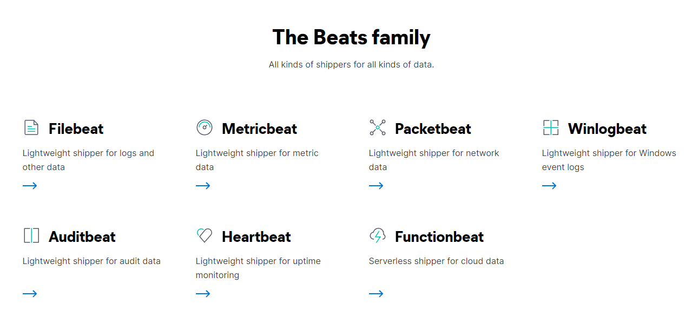

# Beats Introduction

>Beats is a free and open platform for single-purpose data shippers. They send data from hundreds or thousands of machines and systems to Logstash or Elasticsearch.

Beats 為 Elastic Stack 中的一員，在其中主要負責資料採集與資料推送；Beats 是一個以GO語言開發的開源(Open source)應用，作為一個輕量級的應用 Beats 能輕鬆採集系統中的各項資料，並將資料傳送至 Logstash 或 Elasticsearch 上

* Open source data shippers 開源的資料採集
* Libbeat Base 基於 Libbeat framework 以GO語言開發，具輕量的特性
* Beats can send data directly to Elasticsearch or via Logstas 將採集的資料送到 Elasticsearch 或 Logstas

:blue_book: Reference

* [Beats: Data Shippers for Elasticsearch](https://www.elastic.co/beats/)
* [Beats Github](https://github.com/elastic/beats)

## The Beats

 Beats 官方頁面可以看到有許多種類的 Beat，這些 Beat 分別針對不同的環境與不同的數據進行採集，以下為基本的使用情境

目前在 Elastic 官方頁面可以看到這幾個 Beats 提供開發人員使用，以下簡介一下各種 Beat 的使用環境

<!--  -->

## Filebeat 

>Whether you’re collecting from security devices, cloud, containers, hosts, or OT,  
>Filebeat helps you keep the simple things simple by offering a lightweight way to forward and centralize logs and files.

Filebeat 用於採集各式文件，只要是以文件形式存在的檔案都可以用 Filebeat 來進行採集，應該是最常使用的 Beats 之一，  
舉例來說作為應用日誌通常檔案都是 `xxx.log`，使用 Filebeat 便能輕鬆得將這些 Log 傳送至指定的地方，提供查詢與分析

## Metricbeat 

> Collect metrics from your systems and services. From CPU to memory, Redis to NGINX, and much more,  
> Metricbeat is a lightweight way to send system and service statistics.

Metricbeat 用於採集各"指標"資料，這些指標可以是系統的 CPU ; 記憶體 ; 或硬碟空間.....等等系統資訊，  
也可以是某些應用的資本資訊例如: MSSQL 現在的連線數 ; Redis 目前的記憶體用量

## Heartbeat 

> Monitor services for their availability with active probing.  
> Given a list of URLs, Heartbeat asks the simple question: Are you alive?  
> Heartbeat ships this information and response time to the rest of the Elastic Stack for further analysis.

Heartbeat 用於採集系統中的各項應用是否正常運作，Heartbeat 或透過設定好的 URL，定期採集這些暴露出來的 URL 是否成功回應用以確定應用是否還 "活著"

※ 補充 Heartbeat 與 Metricbeat

* Heartbeat : 相當於管生死，以生物來說就是還有沒有生命跡象；以系統來說，監控這個服務或應用是否還是正常運作
* Metricbeat : 相當於管狀態，以生物來說就是血壓、心跳數、體脂肪；以系統來說就是 CPU、記憶體、硬碟空間...等等

## Packetbeat 

>Monitoring your network traffic is critical to gaining observability and securing your environment — ensuring high levels of performance and security.  
>Packetbeat is a lightweight network packet analyzer that sends data from your hosts and containers to Logstash or Elasticsearch.

Packetbeat 用於採集系統的網路流量，  
以 Http 協議為例子，Packetbeat 可以追蹤應用中 HTTP 協議的延遲或錯誤、回應時間、追蹤使用者鏈路...等等

## Winlogbeat 

>Keep a pulse on what's happening across your Windows-based infrastructure.
>Stream Windows event logs to Elasticsearch and Logstash with Winlogbeat.

Winlogbeat 用於採集 Windows 中的各項事件日誌，Winlogbeat 僅僅服務於 Windows 中，  
Winlogbeat 針對 Windows 事件檢視器中資料採集，例如在事件檢視器中 "Windows 記錄" 下的應用程式、安全性、系統......等等的資料

## Auditbeat 

> Collect your Linux audit framework data and monitor the integrity of your files.  
> Auditbeat ships these events in real time to the rest of the Elastic Stack for further analysis.

Auditbeat 用於採集 Linux audit data 或文件變更資料，應該是類似偵測資料夾或文件權限變更的東西，這個我不怎麼熟有空再看看......

## Functionbeat 

> Deploy as a function in your cloud provider’s Function-as-a-Service (FaaS) platform to collect, ship, and monitor data from your cloud services.

Functionbeat 用於採集 cloud services 的相關資料，不過現在的我無可奉告......

## Other

假設上面的 Beats 都不符合需求的話其實也可以擴展自己的 Beat，每個 Beat 皆是以 libbeat 這個 Lib 為基礎來開發，所以真的需要高度客製化也是可以自製自己的 Beats，[list of community Beats](https://www.elastic.co/guide/en/beats/libbeat/current/community-beats.html) 此處收錄一些 Beats 擴展的相關討論社群
