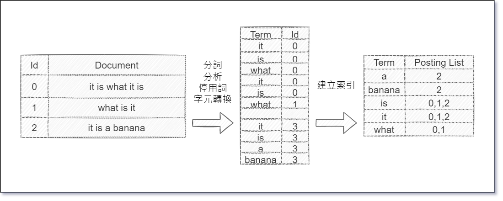
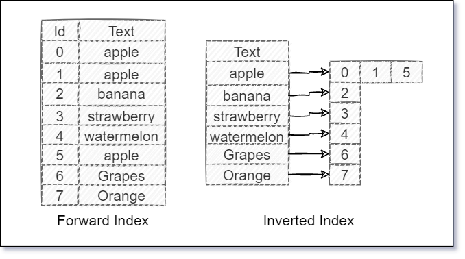

# ELasticsearch

:closed_book: **Chapter Objectives**  

* ELasticsearch 更多基礎知識
* 如同進行正規球賽前要先熟悉規則，使用 ELasticsearch 前基本相關名詞也需要略知一二
* 由關聯型數據庫的概念切入 Elasticsearch 加速理解速度
* Elasticsearch = ES(縮寫)

:blue_book: **Reference**

* [官網](https://www.elastic.co/elasticsearch/)
* [What is an Elasticsearch Index?(2013)](https://www.elastic.co/blog/what-is-an-elasticsearch-index)

## More About ELasticsearch

ELasticsearch 有著 Scalability(可擴展) 與 Near real-time search(接近即時搜尋) 的特性，  
同時也提供了高可用(high availability)的集群架構，  
ELasticsearch 想解決的核心問題就是在數據量大的狀況下也能保有搜尋速度，  
當初作者 Shay Banon 在設計的時候，一開始就是朝向分布式部屬的面相開發 ELasticsearch  
ELasticsearch 核心要素有三個:

* **Data in : documents and indices**
* **Information out : search and analyze**
* **Scalability and resilience**

&nbsp;

* :notebook: 關於系統設計知識補充

  * 分散式系統設計準則 CAP
    * Consistency (一致性)
    * Availability (可用性)
    * Partition Tolerance (分區容忍性)

    :pencil: 一般來說一個分散式架構下，三種特性中只能滿足兩種，  
    &nbsp;&nbsp;&nbsp;&nbsp;&nbsp;&nbsp;拿CAP理論對比資料處理也會有以下三種特性:

  * 資料處理系統設計
    * 數據量龐大
    * 近即時處理
    * 資料準確性

    :pencil: 同理，在資料處理上好像也有類似的概念(之前看到的，找不到原文了...)，  
    &nbsp;&nbsp;&nbsp;&nbsp;&nbsp;&nbsp;而 Elasticsearch 當然是做了某些取捨，使用上請依自身情況把握
    * Elasticsearch 捨棄的是資料準確性，不過在某些數據量巨大的應用場景下，已經不會在乎那一點點資料錯誤了
    * 若要滿足數據量巨大與資料準確性兩個因素，可以使用 Hadoop 或 HBase ...來處理，但就不可能 Realtime 了
    * 資料量小的情況下，什麼!你說資料量小的情況，那沒事了

## RDBMS vs. Elasticsearch

要瞭解 Elasticsearch 可以先用 RDBMS 的概念來對比會比較好理解，但必須  
注意只是拿使用概念來類比，並非 Elasticsearch 本身設計是依 RDBMS 的邏輯開發，兩者在本質上是天差地別  
以下是以 RDBMS 的方式理解 Elasticsearch :  
&nbsp;  
:notebook:&nbsp;&nbsp;Type 這個概念已經在新版本中移除，  
&nbsp;&nbsp;&nbsp;&nbsp;&nbsp;&nbsp;而在 Type 7.x 版本中已經被定義為預設的 _doc，  
&nbsp;&nbsp;&nbsp;&nbsp;&nbsp;&nbsp;因為在 Elasticsearch 中一切皆是索引，不需要再額外劃分一層 Type 來分類，於是被當成過度設計而棄用  
&nbsp;  
|RDBMS&emsp;&emsp;&emsp;&emsp;|Elasticsearch&emsp;&emsp;|
|----|----|
|Database|Index|
|~~Table~~|~~Type~~|
|Row|Document|
|Column|Fields|
|Schema|Mapping|
|SQL|Query DSL|
&nbsp;  

用最簡單的方式，建立"儲存資料的容器"到"將資料儲存到實體位置"的實用角度上來切入 :

* RDBMS

  * 建資料庫
  * 建資料表
  * 設計欄位
  * 插入資料  

  

* Elasticsearch

  * 建立索引 (Index)
  * 設計映射 (Mapping)，此步驟也不一定要有
  * 插入文件 (Document)

  

最後來看一下官方部落格上面的論述(2013年，所有還有Type的概念)

> The easiest and most familiar layout clones what you would expect from a relational database.  
> You can (very roughly) think of an index like a database.  
> ● MySQL => Databases => Tables => Columns/Rows  
> ● Elasticsearch => Indices => Types => Documents with Properties  

Elasticsearch 一詞拆開來看就是 Elastic + Search，  
Elastic 有靈活的意思；Search 則是搜尋，  
為了讓使用者能靈活搜尋，Elasticsearch 在一些格式定義上相對靈活，  
不過要百分之百發揮 Elasticsearch 的搜尋速度還是建議將 "需搜尋的欄位" 的定義給確定下來  
不然官方就不會有文件是專門闡述 Mapping 這個部份了  
&nbsp;  
另一個 Elasticsearch 與 RDBMS 的巨大差異就是 Elasticsearch 不具備 Transaction 的概念，  
但單個請求下是保有 ACID 特性，雖然講起來好像有點矛盾!?  
不過實際使用過 Elasticsearch API 之後，就會有比較深刻的了解 (前提是必須了解RDBMS ACID And Transaction)  
&nbsp;  
所以在真實的應用場景下 Elasticsearch 不會取代 RDBMS，反而是兩者併行相輔相成，  
RDBMS 負責插入與更新資料，再把資料同步到 Elasticsearch 進行搜索。

## Index

Index (索引)為 Elasticsearch 的核心概念之一，  
核心三要之一便是 `Data in : documents and indices`，  
當資料往 Elasticsearch 輸入時，兩個關鍵便是 **documents** and **indices**，  
若是說搜尋引擎為 Elasticsearch 的核心概念，Index 就是支撐這個核心概念的基石，  
若要在 ELK Stack 相關應用上有良好的使用體驗，務必要掌握一下 Index，  
自身的心得是 Elasticsearch Index 這個東西"極端神秘"

* 索引為文件的集合，簡單來說就是把同類型的 documents 藉由 Index 集合再一起，  
  當然索引的設計牽涉到整體搜尋的速度，假設把系統中所有的 documents 都用一個 Index 存起來  
  想當然爾...
* 而一個 Elasticsearch Index 又會分布在一個或多個 Shard 中，而每一個 Shard 又會有自身的 Lucene Index
* Inverted Index

~~這小節有點難寫.. 先擱置一下~~

### Inverted Index

:earth_africa: **www.elastic.co**

> Elasticsearch uses a data structure called an inverted index that supports very fast full-text searches.  

:earth_africa: **Wikipedia**

> 倒排索引（英語：Inverted index），也常被稱為反向索引、置入檔案或反向檔案，  
> 是一種索引方法，被用來儲存在全文搜尋下某個單詞在一個文件或者一組文件中的儲存位置的對映。  
> 它是文件檢索系統中最常用的資料結構。  

&nbsp;
**Elasticsearch 使用 Inverted Index 的資料結構來實現快速的全文搜尋**，  
關於反向索引或稱倒排索引已經是老生常談了(Google一下就一堆)，  
簡單的記錄一下  

* **簡略的轉置流程**  

 若要建立 Inverted Index，首先所有的 Document 會先經過分詞、分析、停用詞、字元轉換後，  
 割成一個一個最小的單詞，再由這些單詞集合成 Inverted Index，  
 ※所以當我們搜尋 `what` 的時候，我們可以知道 `what` 這個關鍵字在文件ID為 `0,1` 這兩個文件中，便不用在每個文件尋訪，  
 以 Wiki 的三句文字為例子，流程如下圖:  
 &nbsp;  
   
 &nbsp;  

 若以 Forward Index (索引) vs. Invert Index (反向索引) 來切入，  
 Invert Index 資料結構是典型的搜尋引擎檢索演算法重要的部分，  
 事實上正因為 Invert Index 的特性，Invert Index 也是文件檢索系統中最常用的資料結構，  
 Forward Index vs. Invert Index 兩者比較如下圖:  
 &nbsp;  
   
 &nbsp;  

### Elasticsearch Inverted Index

更深入的來探討 Elasticsearch 對於 Inverted Index 的實現  
~~這個要整理很久，先把大綱打好~~(未完待續)  

## Document

### Field

### Mapping

## Search

## Analyzer

## Distributed Document Store

### Shard

### Replica
