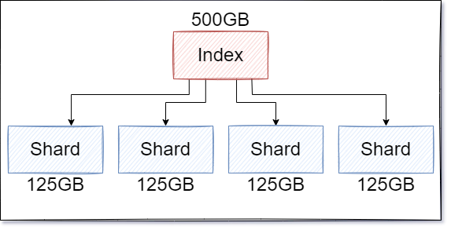

# ELasticsearch

:green_book: **Chapter Objectives**  

* ELasticsearch 更多基礎知識
* 如同進行正規球賽前要先熟悉規則，使用 ELasticsearch 前基本相關名詞也需要略知一二
* 由關聯型數據庫的概念切入 Elasticsearch 加速理解速度
* Elasticsearch = ES(縮寫)

:blue_book: **Reference**

* [官網](https://www.elastic.co/elasticsearch/)
* [What is an Elasticsearch Index?(2013)](https://www.elastic.co/blog/what-is-an-elasticsearch-index)

:closed_book:  **Notice**

只是基於自身理解並且記錄下來，相關知識請皆已官方為最高準則

:notebook_with_decorative_cover: **More**  

假設不知道 Elasticsearch 主要解決甚麼問題可以看一下這個，  
[IT狗的日常](https://www.facebook.com/itdogcom/posts/pfbid0CJU9qASg3yQ9QNQ65YY16qwAZ3mXKz3NNrkYhEQCghRzHaTj5v8APuFmCzsQSBDWl)   
如果連結沒死的話...  

## More About ELasticsearch

ELasticsearch 有著 Scalability(可擴展) 與 Near real-time search(接近即時搜尋) 的特性，  
同時也提供了高可用(high availability)的集群架構，  
ELasticsearch 想解決的核心問題就是在數據量大的狀況下也能保有搜尋速度，  
當初作者 Shay Banon 在設計的時候，一開始就是朝向分布式部屬的面相開發 ELasticsearch  
ELasticsearch 核心要素有三個:

* **Data in : documents and indices**
* **Information out : search and analyze**
* **Scalability and resilience**

&nbsp;

* :notebook: **關於系統設計知識補充**

  * 分散式系統設計準則 CAP
    * Consistency (一致性)
    * Availability (可用性)
    * Partition Tolerance (分區容忍性)

    :pencil: 一般來說一個分散式架構下，三種特性中只能滿足兩種，  
    &nbsp;&nbsp;&nbsp;&nbsp;&nbsp;&nbsp;拿CAP理論對比資料處理也會有以下三種特性:

  * 資料處理系統設計
    * 數據量龐大
    * 近即時處理
    * 資料準確性

    :pencil: 同理，在資料處理上好像也有類似的概念(之前看到的，找不到原文了...)，  
    &nbsp;&nbsp;&nbsp;&nbsp;&nbsp;&nbsp;而 Elasticsearch 當然是做了某些取捨，使用上請依自身情況把握
    * Elasticsearch 捨棄的是資料準確性，不過在某些數據量巨大的應用場景下，已經不會在乎那一點點資料錯誤了
    * 若要滿足數據量巨大與資料準確性兩個因素，可以使用 Hadoop 或 HBase ...來處理，但就不可能 Realtime 了
    * 資料量小的情況下，什麼!你說資料量小的情況，那沒事了

## RDBMS vs. Elasticsearch

要瞭解 Elasticsearch 可以先用 RDBMS 的概念來對比會比較好理解，但必須  
注意只是拿使用概念來類比，並非 Elasticsearch 本身設計是依 RDBMS 的邏輯開發，兩者在本質上是天差地別  
以下是以 RDBMS 的方式理解 Elasticsearch :  
&nbsp;  

* :notebook: **Type補充**

&nbsp;&nbsp;&nbsp;&nbsp;Type 這個概念已經在新版本 8.x 中移除，  
&nbsp;&nbsp;&nbsp;&nbsp;而在 7.x 版本中 Type 已經被定義為預設的 _doc，  
&nbsp;&nbsp;&nbsp;&nbsp;因為在 Elasticsearch 中一切皆是索引，不需要再額外劃分一層 Type 來分類，於是被當成過度設計而棄用  
&nbsp;  
|RDBMS&emsp;&emsp;&emsp;&emsp;|Elasticsearch&emsp;&emsp;|
|----|----|
|Database|Index|
|~~Table~~|~~Type~~|
|Row|Document|
|Column|Fields|
|Schema|Mapping|
|SQL|Query DSL|
&nbsp;  

用最簡單的方式，建立"儲存資料的容器"到"將資料儲存到實體位置"的實用角度上來切入 :

* **RDBMS**

  * 建資料庫
  * 建資料表
  * 設計欄位
  * 插入資料  

  

* **Elasticsearch**

  * 建立索引 (Index)
  * 設計映射 (Mapping)，此步驟也不一定要有
  * 插入文件 (Document)

  

最後來看一下官方部落格上面的論述(2013年，所有還有Type的概念)

> The easiest and most familiar layout clones what you would expect from a relational database.  
> You can (very roughly) think of an index like a database.  
> ● MySQL => Databases => Tables => Columns/Rows  
> ● Elasticsearch => Indices => Types => Documents with Properties  

Elasticsearch 一詞拆開來看就是 Elastic + Search，  
Elastic 有靈活的意思；Search 則是搜尋，  
為了讓使用者能靈活搜尋，Elasticsearch 在一些格式定義上相對靈活，  
不過要百分之百發揮 Elasticsearch 的搜尋速度還是建議將 "需搜尋的欄位" 的定義給確定下來  
不然官方就不會有文件是專門闡述 Mapping 這個部份了  
&nbsp;  
另一個 Elasticsearch 與 RDBMS 的巨大差異就是 Elasticsearch 不具備 Transaction 的概念，  
但單個請求下是保有 ACID 特性，雖然講起來好像有點矛盾!?  
不過實際使用過 Elasticsearch API 之後，就會有比較深刻的了解 (前提是必須了解RDBMS ACID And Transaction)  
&nbsp;  
所以在真實的應用場景下 Elasticsearch 不會取代 RDBMS，反而是兩者併行相輔相成，  
RDBMS 負責插入與更新資料，再把資料同步到 Elasticsearch 進行搜索。

## Index

Index (索引)為 Elasticsearch 的核心概念之一，  
核心三要之一便是 `Data in : documents and indices`，  
當資料往 Elasticsearch 輸入時，兩個關鍵便是 **documents** and **indices**，  
若是說搜尋引擎為 Elasticsearch 的核心概念，Index 就是支撐這個核心概念的基石，  
若要在 ELK Stack 相關應用上有良好的使用體驗，務必要掌握一下 Index，  
自身的心得是 Elasticsearch Index 這個東西"極端神秘"

* 索引為文件的集合，簡單來說就是把同類型的 documents 藉由 Index 集合再一起，  
  當然索引的設計牽涉到整體搜尋的速度，假設把系統中所有的 documents 都用一個 Index 存起來  
  想當然爾...
* 而一個 Elasticsearch Index 又會分布在一個或多個 Shard 中，而每一個 Shard 又會有自身的 Lucene Index
* Inverted Index

~~這小節有點難寫.. 先擱置一下~~

### Inverted Index

:earth_africa: **www.elastic.co**

> Elasticsearch uses a data structure called an inverted index that supports very fast full-text searches.  

:earth_africa: **Wikipedia**

> 倒排索引（英語：Inverted index），也常被稱為反向索引、置入檔案或反向檔案，  
> 是一種索引方法，被用來儲存在全文搜尋下某個單詞在一個文件或者一組文件中的儲存位置的對映。  
> 它是文件檢索系統中最常用的資料結構。  

&nbsp;
**Elasticsearch 使用 Inverted Index 的資料結構來實現快速的全文搜尋**，  
關於反向索引或稱倒排索引已經是老生常談了(Google一下就一堆)，  
簡單的記錄一下  

* **簡略的轉置流程**  

 若要建立 Inverted Index，首先所有的 Document 會先經過分詞、分析、停用詞、字元轉換後，  
 割成一個一個最小的單詞，再由這些單詞集合成 Inverted Index，  
 ※所以當我們搜尋 `what` 的時候，我們可以知道 `what` 這個關鍵字在文件ID為 `0,1` 這兩個文件中，便不用在每個文件尋訪，  
 以 Wiki 的三句文字為例子，流程如下圖:  
 &nbsp;  
   
 &nbsp;  

 若以 Forward Index (索引) vs. Invert Index (反向索引) 來切入，  
 Invert Index 資料結構是典型的搜尋引擎檢索演算法重要的部分，  
 事實上正因為 Invert Index 的特性，Invert Index 也是文件檢索系統中最常用的資料結構，  
 Forward Index vs. Invert Index 兩者比較如下圖:  
 &nbsp;  
   
 &nbsp;  

### Inverted Index For Elasticsearch

更深入的來探討 Elasticsearch 對於 Inverted Index 的實現  
~~這個要整理很久，先把大綱打好~~(未完待續)  

## Document

> Elasticsearch is a distributed document store.  
> Instead of storing information as rows of columnar data,  
> Elasticsearch stores complex data structures that have been serialized as JSON documents.  

* **重點 =>** `Elasticsearch is a distributed document store`  
  **Elasticsearch 是一個分布式的文件資料庫**  
  **Elasticsearch 是一個分布式的文件資料庫**  
  **Elasticsearch 是一個分布式的文件資料庫**  

* **Index 與 Documents 的關係**  
  最 **簡單** 來說就是一個 Index 裡面，會有很多同屬性的 Documents  
  (當然實際場景下遠比這個複雜得多，還有 Node; Shard; 那些有的沒的)  
  &nbsp;  
    

* **數據最小單位**

  Document 已經是 Elasticsearch 儲存資料單元中最小的單位了

* **JSON Documents**

  > Elasticsearch stores complex data structures that have been serialized as JSON documents

  儲存進 Elasticsearch 的資料都將被序列化為 JSON documents，  
  所以 documents 通常以 JSON 來表示，  
  事實上，再使用 Elasticsearch 時也都透過 HTTP 與 JSON 來與 Elasticsearch 溝通居多

* **Unique Id**
  
  每個 Document 接有自己的唯一 ID，  
  不管是在建立的時候使用者賦予，或是由系統自身配給，  
  通常讓系統本身管理會是比較明智的選擇

* **Schema-less**

  >Elasticsearch also has the ability to be schema-less
  
  Schema-less 為一種彈性的儲存結構，並不僅限存在於 Elasticsearch 中，  
  MongoDB ...等等的資料庫，也是具備 Schema-less 屬性，  
  Schema-less 提供了什麼特性?  

  > which means that documents can be indexed without explicitly specifying how to handle each of the different fields that might occur in a document.  

  在存儲資料時不需要事先定義美個文件中的格式(fields)便可將文件儲存，  
  Elasticsearch 中提供 Dynamic mapping 的機制，  
  在文件進到 Elasticsearch Index 時會自動的判別 fields 並把 fields 添加進 Index 中，  

  > ​just start indexing documents and Elasticsearch will detect and map booleans,  
  > floating point and integer values, dates, and strings to the appropriate Elasticsearch data types.

  使用者僅需要往索引中間添加文件，Elasticsearch 會自動幫你判別型態，  
  需要注意的是 Dynamic mapping 也不是如此的完美，  
  所以有時候還是需要使用者自己定義

* :notebook: **Schema-less 知識補充**

  Schema-less 雖然看似方便其實還是有些問題存在 1. 需要大量 Index ; 2.弱資料正確性  
  所以 MongoDB 變成有點類似 Dynamic schema，  
  Elasticsearch 則是有 Dynamic mapping，  
  到若要在本質上攻克 Schema-less 有另一個東西，Wide Column Stores - `Cassandra`

* :notebook: **關於 NoSQL 知識補充**
  
  Elasticsearch 屬於文件型資料庫，  
  Google `NoSQL` 拉到文件儲存列表就會看到了，  
  目前對於 NoSQL 分類的主流說法，大體分成四個:  
  * 文件型資料庫
  * Key-value 鍵值對資料庫
  * 圖資料庫
  * 列資料庫

### Mapping

> Mapping is the process of defining how a document, and the fields it contains, are stored and indexed.

在 Elasticsearch 中每個 Document 內包含多個 fields，而且這些 fields 會有屬於自己的 data type，  
當資料以 Document 進入 Elasticsearch 中時，會自動的 Mapping 每個 fields 的 data type，  
此時有兩種情況，  
當這個欄位有事先被定義時，會根據已定義的規則 Mapping，  
而沒有定義的欄位則會由 Dynamic Mapping 判斷此欄位的資料型態  
&nbsp;  
在實務使用上最好事先定義好 Mapping，    
因為一個 Index 的 Mapping 一旦建立便不能修改，  
Elasticsearch 中存在一種 Aliases 的機制，可讓使用者較為方便維護 Index 之更迭，  
但還是要經過 Reindex 的動作才能完成更新，  
以下粗略介紹一下兩種 Mapping

* :notebook: **Mapping Types 知識補充**

> Elasticsearch 8.0.0 no longer supports mapping types.  
> For details on how to migrate your clusters away from mapping types,  
> see the removal of types documentation for the 7.x release.  

隨著 types 的棄用，Elasticsearch 8.0.0 已經不提供 Mapping Types 機制，
稍微注意一下就好

### Dynamic mapping

> When Elasticsearch detects a new field in a document,  
> it dynamically adds the field to the type mapping by default.

官方文件指名當有一個新得 field 在文件中時，Elasticsearch 將會自動得進行 type mapping，
意即 Elasticsearch 幫我們判斷 JSON 中欄位的資料型態，這個機制稱為 `Dynamic field mapping`

> Dynamic templates allow you greater control of how Elasticsearch maps your data beyond the default dynamic field mapping rules.

此外 Elasticsearch 也提供 `Dynamic templates` 可以讓使用者詳細自訂自己需要的映射規則 `dynamic field mapping rules` (中文實在不好講)

### Explicit mapping

Explicit mapping 可準確定義欄位型態，當我們已經知道 Document 數據是什麼，  
可以如同定義資料表型態一樣，  
來定義文件中的欄位型態其中包括(原文比較貼切...):  

* Which string fields should be treated as full text fields.  
  那些 string fields 要使用 full text fields
* Which fields contain numbers, dates, or geolocations.  
  那些 fields 是數字、日期、地理資訊
* The format of date values.  
  日期格式  
* Custom rules to control the mapping for dynamically added fields.  
  這個 fields 可以使用的 Dynamic field mapping 方式  

>Use runtime fields to make schema changes without reindexing.  

另外使用 `runtime fields` 可以在不用 reindexing 的情況下進行型態的更新，  
但其副作用就是搜索效率的降低，請自己衡量再三

### Field

沒甚麼特別的就是一個 Field，注意一下這個 Field 是不是要跑全文索引即可，例如:  
被設定成 `text` 類型的 Field 會進行全文檢索分析，  
被設定成 `keyword` 類型的僅提供查詢篩選或其他聚合操作......等等

另外需要知道一個 `Multi-fields` 機制，
用來對同一個 field 賦予不同的屬性
> Multi-fields,It is often useful to index the same field in different ways for different purposes.  

### Metadata fields

> Each document has metadata associated with it, such as the _index and _id metadata fields.

每個 document 通常有著自己的 Metadata，常見的有 `_index` 文件所在索引; `_id` 文件唯一Id

### Field data types

> Each field has a field data type, or field type.  

每個 Field 都有自己的 Field data types [詳見](https://www.elastic.co/guide/en/elasticsearch/reference/current/mapping-types.html)  
(預計會寫在 Mapping 那個章節)  

## Search

> The Elasticsearch REST APIs support structured queries, full text queries, and complex queries that combine the two.  
運用 Elasticsearch 來進行搜尋只有幾個重點:

* **結構化查詢 + 全文檢索查詢**
* **REST APIs**
* **Query DSL (Domain Specific Language)**
* **~~其實還有 SQL-style queries~~**

其他請見搜尋類的筆記...

## Analyzer

> Elasticsearch aggregations enable you to build complex summaries of your data and gain insight into key metrics, patterns, and trends.

恩... 就是 Elasticsearch 也有提供`聚合查詢`..OK吧.. (´．ω．`)  

喔... 還有`machine learning`，哪次不 machine learning 對吧 (´-ω-｀)

## Distributed Document Store

**Elasticsearch 是一個分布式的文件資料庫**  
Elasticsearch 是一個具有分布式架構特徵的應用，所以會有集群這個概念，  
整個 Elasticsearch 的真面目其實比較像這個樣子，如下圖:  

### Cluster

Elasticsearch Cluster 一個Elasticsearch的集群中可以包含一個或多個 Node，  
通常使用上我們可以根據需求對集群中的節點進行編排，  
藉由集群的特性實現**水平擴充**，  
同時可以藉由集群來提供**高可用**的服務環境 ( High availability services )，

* :notebook: **High availability 知識補充**

  在分布式系統設計中"高可用"是一定會被討論到的問題，  
  常見的解決方案都有針對高可用的描述 Ex: Redis,Kafka，  
  可以參考比較其中的作法，並應用在系統設計上  

### Node

由架構圖可以見得，一個 Elasticsearch Cluster 中會包含數個 Node，  
每個 Node 皆可以視為一個獨立的 Elasticsearch 應用，  
每個 Node 都應該在一個"獨立"的環境上運行 (ex: container or VM)
在測試環境上可以將 Node 建置在同一主機上面，  
若是實際應用的生產環境，還是建議將不同的節點獨立到不同的主機上，以保證高可用的特性  

在 Elasticsearch Cluster 每個 Node 可以藉由 `Node Roles` 賦予集群中的節點不同任務，常見的總類有:  

* **Data Nodes**
* **Master Nodes**
* **Ingest Nodes**
* **Machine Learning Nodes**
* **Coordinator Nodes**

詳細會在分布式的筆記中記錄

### Shard

Shard 又或是"分片"，在 Elasticsearch 中一個 Index 會被切分成多個 Shard 保存在不同的地方，  
可以想像成一個資料庫放不下了，所以分庫儲存，  
Shard 的機制幫助 Elasticsearch 實現了 **資料的高可用** 與 **可擴展性**，  
> There are two types of shards: primaries and replicas.  

在 Elasticsearch 中存在著兩種 Shard，如下:  

* **Primary Shard**

> Each document in an index belongs to one primary shard.  

  用來儲存資料，即儲存 document

* **Replica Shard**
> A replica shard is a copy of a primary shard.  

  用來作為 Primary Shard 資料的副本，同時有兩個主要功能，作為高可用的硬體容錯並且增加查詢時的效能

假若今天僅僅只是簡單的應用 Elasticsearch Shard 機制可以這樣理解，  
每個 Shard 都有一個自己的 Replica (每個分片都有自己的副本)，  
同時； Shard 與自己成對的 Replica 不會在同一個 Node 上面，  
並且；當這些 Shard 集合在一起時就是一個完整的 Index  

 

以物理層面來說就是資料量預期會很大，所以切開來放到不同的地方，  
如果以實際 Elasticsearch 實踐的架構來說是，  
每個 Shard 都是 Index 的一部分，而每個 Shard 又是一個  `lucene index` ，  
每個 `lucene index` 又管理一群 `Segment`，用圖解可能比較清楚  

* **這是資料切片**

  

* **這是實際架構**  

  

在 Elasticsearch 中，正確的使用 Shard 將會帶來的好處

* **更大的儲存空間，資料分散到不同的 Node**
* **更有效率的搜尋效能，當一個 Query 進來時也分散到不同的 Node 上**

> The number of primary shards in an index is fixed at the time that an index is created,  
> but the number of replica shards can be changed at any time,  
> without interrupting indexing or query operations.

需要特別注意的點；  
只有在一開始建立 Index 時才可以指定 Primary Shard 的數量，  
Replica Shards 則是在任何時候都可以變更，  
但如果非得要變更 Primary Shard 就需要 ReIndex 了，  
在 Elasticsearch 官方網站中，也有很多探討關於 Shard 策略的文章，都可以參考看看 

[size-your-shards](https://www.elastic.co/guide/en/elasticsearch/reference/current/size-your-shards.html)

* :notebook: **Segment 知識補充**

  Elasticsearch 是一個基於 Lucene 實作的應用，  
  在 Lucene 中最小的儲存單位即是 Segment，一個 Segment當中包含:  

  * Inverted Index
  * Sorted Fields
  * Document Values
  * Cache

## Conclusion

理解一門技術，一些名詞還是必要之惡，  
一邊理解名詞一邊補原理 ~~(才能唬人)~~，  
概念性的知識太多頭實在很痛，  
有漏掉的東西之後真的有使用到或想到再回來補吧  

