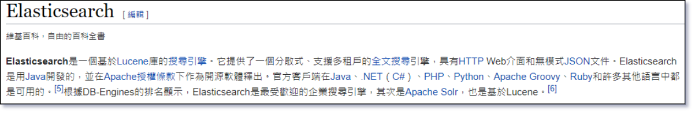
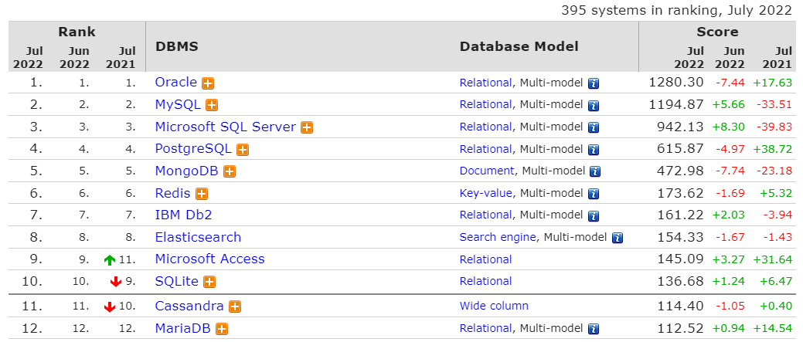
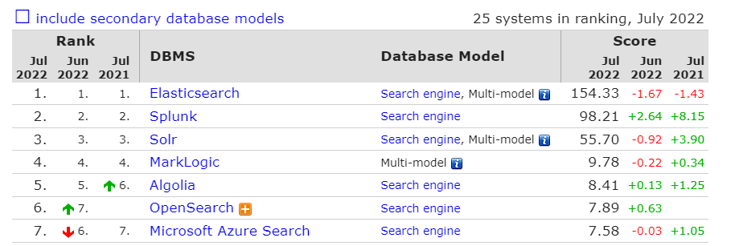

# ELK Stack Intro

:closed_book: **What is ELK Stack**

* ELK Stack = E(Elasticsearch) + L(Logstash) + K(Kibana) + Beats + Other
* 本小節偏重於 Elasticsearch

:blue_book: Reference

* [Elastic 官方傳送門](https://www.elastic.co/)

## What is ELK Stack

* ELK 是三個開放原始碼專案的頭一字，分別是 E(`Elasticsearch`) + L(`Logstash`) + K(`Kibana`)
* Elasticsearch : 一個搜索引擎
* Logstash : 一個 "server‑side" 的資料轉換管道(pipeline) "stash" 有存起來的意思，所以 `Logstash` 可以讓資料經過 "pipeline" 處理後儲存到某個地方
* Kibana : 一個資料化可視平台
* Beats : 一個輕量級資料採集解決方案，相較於 `Logstash` 離"應用"距離更近

## Elasticsearch Overview

以下是來至 Wiki 的說明:  
&nbsp;  

&nbsp;  
小結幾個重點:

* **搜尋引擎**

  當有人問 Elasticsearch 是什麼? 最簡單的回答就是四個字 : **搜尋引擎 (search engine)**

  > 搜尋引擎（英語：search engine）是一種資訊檢索系統，旨在協助搜尋儲存在電腦系統中的資訊。  
  > 搜尋結果一般被稱為「hits」，通常會以表單的形式列出。  
  > 網路搜尋引擎是最常見、公開的一種搜尋引擎，其功能為搜尋全球資訊網上儲存的資訊。  

  * 不管在什麼環境下當成功啟動 Elasticsearch 的那一刻，它會就會告訴你 **「You Know, for Search!」**
  * 搜尋結果一般被稱為「hits」，事實上使用 Elasticsearch 做搜尋，在搜尋結果中就是會有 **「hits」** 這個屬性欄位

* **基於 Lucene 庫的搜尋引擎**

  > Lucene是一套用於全文檢索和搜尋的開放原始碼程式庫，由Apache軟體基金會支援和提供。  
  > Lucene提供了一個簡單卻強大的應用程式介面，能夠做全文索引和搜尋。  
  > Lucene是現在最受歡迎的免費Java資訊檢索程式庫。  
  > From Wiki

  Elasticsearch 是基於 `Lucene` 封裝的應用，因為 Lucene 有些 API 再用於開發時，並不是那麼容易操作，  
  就像 Docker 跟容器技術一樣( Docker 的出現使容器技術更容易使用)，  
  Elasticsearch 讓使用者可以用更簡便的方式使用 Lucene 來進行全文檢索與作為搜索引擎使用  

  :notebook: 小知識 :
  * Lucene 的作者為 **Doug Cutting**
  * **Doug Cutting** 同時也是一項知名開源框架的作者 【 Hadoop 】
  * Elasticsearch 的原作者為 **Shay Banon**
  * 有趣的傳聞 Elasticsearch 是 **Shay Banon** 為他老婆寫得 食譜搜尋 Side project

* **分散式、支援多租戶**
  
  Elasticsearch 是一個分散式的 `No SQL` 資料庫，Elasticsearch 自帶分散式的架構可以輕鬆實現水平擴容，  
  藉由搭建 Elasticsearch Cluster，在 Cluster 中啟動各種不同功能的結點 (Node)，可以任意搭建自己的分散式架構  
  Elasticsearch 在 Multi-Tenancy(多租戶)方面的表現，常見的策略有 Cluster per tenant ; Index per tenant ; Tenant-based routing  
  或者是**百度**有自己擴展的 Elasticsearch `BES`，可以參考看看

* **全文搜尋引擎**
  
  全文搜尋引擎這像技術目前廣泛應用於各項主流的搜索引擎，Elasticsearch 就是一個全文搜尋引擎，  
  目前在市場上就有許多"大IP"使用 Elasticsearch 來解決搜尋問題，  
  e.g.,Github,Uber,Facebook,百度,東京...更甚至這些大型服務提供商都有基於自身應用所改良的 Elasticsearch 架構

  * **Full-text search 全文檢索**

    Full-text search `從文字或資料庫中，不限定資料欄位，自由地萃取出訊息的技術`，`全文檢索`並非 Elasticsearch 獨佔的技術，  
    其實 SQL Server 與 MySQL 也有全文檢索搜尋只是表現沒 Elasticsearch 這麼優秀，  
    而通常執行 `全文檢索` 任務的程式或應用，一般被稱作【搜尋引擎】

  * **Full-text search 相關技術**
  
    以下是與 Full-text search 相關的拓撲，基本上在 Elasticsearch 中全部都會出現，  
    行有餘力的話瞭解一下相關知識會比較好上手
    * 語根處理 stemming
    * 符素解析器 token parser
    * 斷詞/分詞 word segmentation
    * 反向索引 inverted index
    * 查全率 Recall rate
    * 查準率 Precision

* **HTTP Web介面和無模式(Schema-less)JSON文件**
  
    Elasticsearch 以 HTTP 協議，提供了"純正" `REST APIs`，透過操作 `REST API` 得以讓使用者操作 Elasticsearch 中的相關功能，  
    在 Elasticsearch 中 Server 與 Client 交換資訊大多以 `JSON` 格式為主，  
    在某些特殊且特定的情況下 Elasticsearch 也提供了 compact and aligned text (CAT) 的格式，提供使用者一個更為整潔得資料呈現方式
  * compact and aligned text (CAT)
    > JSON is great…​ for computers.
    > Even if it’s pretty-printed, trying to find relationships in the data is tedious.  
    > Human eyes, especially when looking at a terminal, need compact and aligned text.  
    > The compact and aligned text (CAT) APIs aim to meet this need.  
    > From Elastic.co  

    簡言之就是，人(工程師)在閱讀 `JSON` 時是有"些許"障礙的所以有了 CAT
    > cat APIs are only intended for human consumption using the Kibana console or command line.  
    > They are not intended for use by applications.  
    > For application consumption, we recommend using a corresponding JSON API.  

    Cat 只允許在 Kibana console or command line 中使用，在其他的應用中我們不建議使用，來自官方的建言

* **Elasticsearch是用Java開發的**

  如上所述 Elasticsearch 用 Java 開發在 Github 上都可以看到原始碼，  
  這也意味著真的要完全優化 Elasticsearch 也要懂一點 JVM 相關的知識...

* **開源軟體**
  
  網址純推不下 => [https://github.com/elastic](https://github.com/elastic)  
  官方 GIT 裡面有一個放測試資料的地方，突然忘記在哪裡了找到再貼過來...

* **官方客戶端在Java、.NET（C#）、PHP、Python、Apache Groovy、Ruby和許多其他語言中都是可用的**

  基本像這種熱門的應用，集成環境應該都是很成熟了，  
  在不濟接口都是 `REST APIs` 了...

* **根據 DB-Engines 的排名顯示，Elasticsearch是最受歡迎的企業搜尋引擎**

  一個非常有公信力的 DB 排名網站，後端工程師應該沒有不來這裡參考的吧...  

  [https://db-engines.com/en/](https://db-engines.com/en/)

   這是 July 2022 全部排名，該在榜上的還在榜上，  
   基本上 Elasticsearch 還是不能取代關聯型資料庫的，這點必須特別注意，  
   (不過 MongoDB 是主打取代 RDBMS 就是ㄏㄏ)  
   通常 NoSQL 都是用來解決 SQL 解決不了的問題，  
   Elasticsearch 它的優勢就不用特別在強調了看名字就知道了 Elastic**search** 強項是 **搜尋**

    

  這是 DB-Engines Ranking of Search Engines 搜尋引擎的排行榜  
  基本上 Elasticsearch 已經好幾年沒下來過了，而且有好一陣子熱度都是兩倍輾壓第二名  
  除非有更好的解決方案，或有人用GO寫一個差不多的東西才有可能下來..大概!?  

  

## Conclusion
  
本來要繼續寫 Elasticsearch 其他的知識點，不過篇幅好像有點長了，這邊就只放概念性的東西吧

Finally, What is Elasticsearch?

* Search Engine
* Member of ELK
* You Know, for Search !
