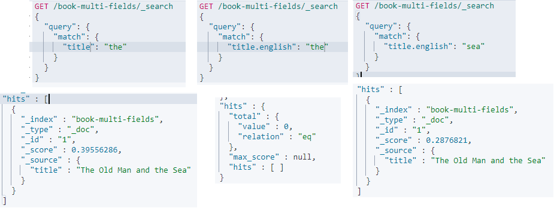

# Elasticsearch Analyzer

Elasticsearch 中的分析器，是為什麼 Elasticsearch 能夠作為搜尋引擎的關鍵，在將 Document 加入 index 前，會先透過 Analyzer 將 Document 進行拆解(過濾、分詞)，並建立反向索引，以便 Elasticsearch 透過反向索引進行字詞搜尋

* [官方API文件](https://www.elastic.co/guide/en/elasticsearch/reference/current/indices-analyze.html)

## Analyzer 基本

在 elasticsearch 分析器的基本流程為 Character Filter > Tokenizer > Token Filter

* Character Filter : 過濾，根據所選的 character filter 會將不需要的字符給過濾掉；etc : HTML標籤，標點符號
* Tokenizer : 分詞，每個分析器必備的流程，負責重要的分詞處理
* Token Filter : 將分詞後的 Token 做個別處理；etc :大小寫轉換

## Analyzer 使用

使用一個簡單的範例來看看 Elasticsearch 是如何分詞的，先將 The Old Man and the Sea 插入索引中

```sh
POST book/_doc/1
{
    "title":"The Old Man and the Sea"
}
```

接著使用下列API，查詢分詞結果

```JSON
GET <index>/_analyze
{
  "field": "欄位名",
  "text": "內容"
}
```

```sh
GET book/_analyze
{
  "field": "title",
  "text": "The Old Man and the Sea"
}
```

elasticsearch 中預設的 analyzer 是 `"analyzer" : "standard"`，會將所有的字詞進行拆分，結果如下:

```JSON
{
    {
        "tokens" : [
            {
            "token" : "the",
            "start_offset" : 0,
            "end_offset" : 3,
            "type" : "<ALPHANUM>",
            "position" : 0
            },
            {
            "token" : "old",
            "start_offset" : 4,
            "end_offset" : 7,
            "type" : "<ALPHANUM>",
            "position" : 1
            },
            {
            "token" : "man",
            "start_offset" : 8,
            "end_offset" : 11,
            "type" : "<ALPHANUM>",
            "position" : 2
            },
            {
            "token" : "and",
            "start_offset" : 12,
            "end_offset" : 15,
            "type" : "<ALPHANUM>",
            "position" : 3
            },
            {
            "token" : "the",
            "start_offset" : 16,
            "end_offset" : 19,
            "type" : "<ALPHANUM>",
            "position" : 4
            },
            {
            "token" : "sea",
            "start_offset" : 20,
            "end_offset" : 23,
            "type" : "<ALPHANUM>",
            "position" : 5
            }
        ]
    }
}
```

也可以直接指定 Analyzer 做測試

```JSON
GET _analyze
{
    "analyzer": "分析器種類",
    "text" : "內容"
}
```

```JSON
GET _analyze
{
    "analyzer": "standard",
    "text" : "The Old Man and the Sea"
}
```

## 內建分析器

Elasticsearch 內建幾個分析器如下:

* Standard Analyzer
* Simple Analyzer
* Whitespace Analyzer
* Stop Analyzer
* Keyword Analyzer
* Pattern Analyzer
* Language Analyzers
* Fingerprint Analyzer

另外可以自定義 Custom analyzer [文件來源](https://www.elastic.co/guide/en/elasticsearch/reference/current/analysis-analyzers.html#_custom_analyzers)

稍微整理一下內建分析器的 Example output ，都是以官方範例 "The 2 QUICK Brown-Foxes jumped over the lazy dog's bone." 為基準，只是放在一起比較容易比較其中差異 :

### **Standard Analyzer**

預設的 `Analyzer` 若無特別指定就是這個，直接切分；小寫顯示

```JSON
POST _analyze
{
  "analyzer": "standard",
  "text": "The 2 QUICK Brown-Foxes jumped over the lazy dog's bone."
}
```

輸出:

```JSON
[ the, 2, quick, brown, foxes, jumped, over, the, lazy, dog's, bone ]
```

### **Simple Analyzer**

>The simple analyzer breaks text into tokens at any non-letter character, such as numbers, spaces, hyphens and apostrophes, discards non-letter characters, and changes uppercase to lowercase.
將 Text 以數字、空白、符號分詞，並刪去非字母的文字；小寫顯示

```JSON
POST _analyze
{
  "analyzer": "simple",
  "text": "The 2 QUICK Brown-Foxes jumped over the lazy dog's bone."
}
```

輸出:

```JSON
[ the, quick, brown, foxes, jumped, over, the, lazy, dog, s, bone ]
```

### **Whitespace Analyzer**

>The whitespace analyzer breaks text into terms whenever it encounters a whitespace character.

簡單粗暴，遇到空白就斷詞；不轉小寫

```JSON
POST _analyze
{
  "analyzer": "whitespace",
  "text": "The 2 QUICK Brown-Foxes jumped over the lazy dog's bone."
}
```

輸出

```JSON
[ The, 2, QUICK, Brown-Foxes, jumped, over, the, lazy, dog's, bone. ]
```

### **Stop Analyzer**

>The stop analyzer is the same as the simple analyzer but adds support for removing stop words. It defaults to using the _english_ stop words.

與 `simple analyzer` 相同，但多了**過濾** `Stop Analyzer` 使用 `_english_` 來過濾特定的 `stop words`(停用詞)

```JSON
POST _analyze
{
  "analyzer": "stop",
  "text": "The 2 QUICK Brown-Foxes jumped over the lazy dog's bone."
}
```

輸出結果將 `the`;`2` 停用詞過濾掉了 [有一個章節專門描述停用詞](https://www.elastic.co/guide/en/elasticsearch/reference/current/analysis-stop-tokenfilter.html)

```JSON
[ quick, brown, foxes, jumped, over, lazy, dog, s, bone ]
```

### **Keyword Analyzer**  

> The keyword analyzer is a “noop” analyzer which returns the entire input string as a single token.

一句話總結:就是【不分詞】

```JSON
POST _analyze
{
    "analyzer": "keyword",
    "text": "The 2 QUICK Brown-Foxes jumped over the lazy dog's bone."
}
```

輸出

```JSON
[ The 2 QUICK Brown-Foxes jumped over the lazy dog's bone. ]
```

### **Pattern Analyzer**

> The pattern analyzer uses a regular expression to split the text into terms. The regular expression should match the token separators not the tokens themselves. The regular expression defaults to \W+ (or all non-word characters).

以正則表示式作為分詞依據，預設是 \W+，很玄幻的分析器有機會用到在特別紀錄

```JSON
POST _analyze
{
  "analyzer": "pattern",
  "text": "The 2 QUICK Brown-Foxes jumped over the lazy dog's bone."
}
```

輸出

```JSON
[ the, 2, quick, brown, foxes, jumped, over, the, lazy, dog, s, bone ]
```

### **Language Analyzers**

  >A set of analyzers aimed at analyzing specific language text  
  特定語言的分析器，支援的語言[點這裡](https://www.elastic.co/guide/en/elasticsearch/reference/current/analysis-lang-analyzer.html)
  然後沒有中文，中文在ES中是特別的存在，開一節特別紀錄

## Index Mapping & Analyzer

可以在創建 Index 時 Mapping 自己想要的 Analyzer，但要注意的是 Mapping 後的欄位就不能更改其 Analyzer 了，除非使用 Reindex

### Index Mapping 基本使用

實驗一下，對 book 這個 `index` 新增一個 `field` title3 其類型為 `text` ;分析器為 `simple`

```JSON
PUT /book/_mapping/
{
    "properties":{
        "title3":{
        "type":"text",
        "analyzer":"simple"
        }
    }
}
```

查詢 `index` `mapping` 的設定  

```JSON
GET /book/_mapping/
```

可以看到 Title3 的 `analyzer` 為 `simple`，第一個 Title 為預設新增的可以看到 `properties` 中有一個 `fields` 這個便是 `Multi-field`，下一小段說明 `Multi-field`

```JSON
{
    "book" : {
        "mappings" : {
            "properties" : {
                "title" : {
                "type" : "text",
                "fields" : {
                    "keyword" : {
                    "type" : "keyword",
                    "ignore_above" : 256
                    }
                }
                },
                "title2" : {
                "type" : "text",
                "analyzer" : "standard"
                },
                "title3" : {
                "type" : "text",
                "analyzer" : "simple"
                }
            }
        }
    }
}
```

### Multi-fields

我們可以透過分配不同的 Multi-fields 在同一個字段中使用不同的 analyzer 來提升搜尋的準確度。

* 先創建一個 `index` 讓主要的 `analyzer` 為 `simple`，`fields` 中的為 `english`

```JSON
PUT /book-multi-fields
{
  "mappings":{
    "properties":{
      "title":{
        "type":"text",
        "analyzer":"simple",
        "fields":{
          "english":{
            "type":"text",
            "analyzer":"english"
          }
        }
      }
    }
  }
}
```

往 `index` book-multi-fields 中放入一筆資料 `"title":"The Old Man and the Sea"`

```JSON
POST /book-multi-fields/_doc/1
{
  "title":"The Old Man and the Sea"
}
```

接著搜尋以下三種情況:

```JSON
GET /book-multi-fields/_search
{
  "query": {
    "match": {
      "title": "the"
    }
  }
}
```

```JSON
GET /book-multi-fields/_search
{
  "query": {
    "match": {
      "title.english": "the"
    }
  }
}
```

```JSON
GET /book-multi-fields/_search
{
  "query": {
    "match": {
      "title.english": "sea"
    }
  }
}
```

  
結果為第一個命中，第二個未命中，第三個命中，這是因為條件為 `title` 時分析器為 `simple` 會保留 `the`，條件為 `title.english` 時，分析器 english 會將 `the` 作為 stop words 過濾掉。

## 客製化 Analyzer

待補
