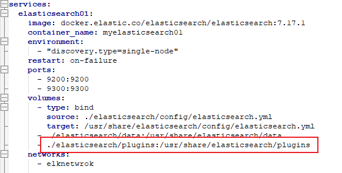
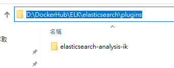
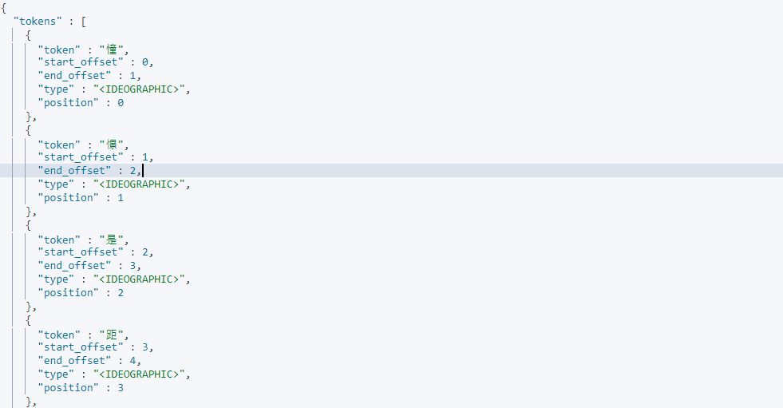
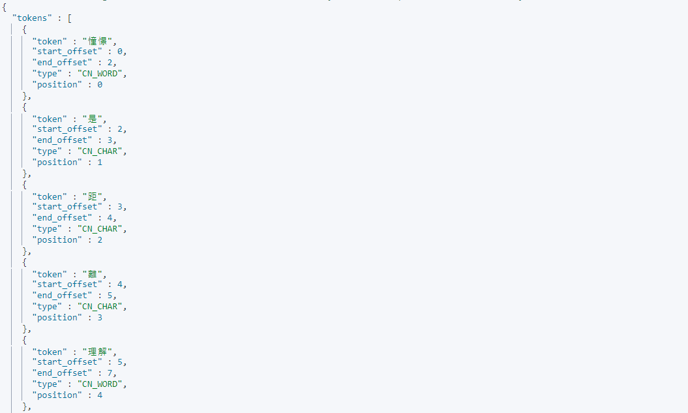
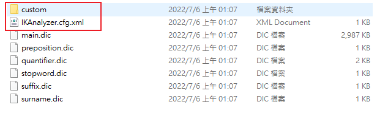
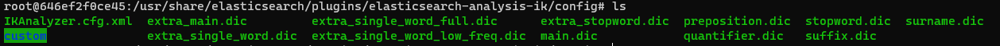
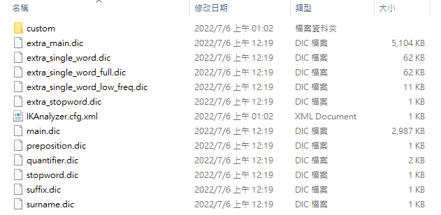
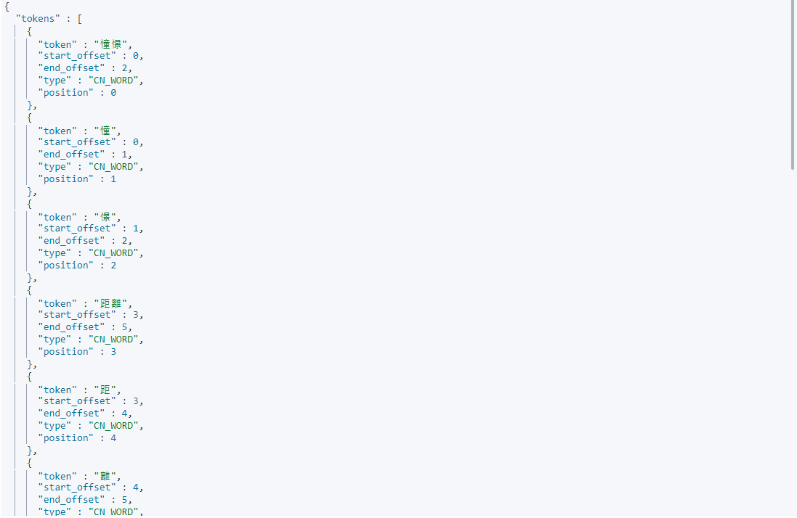
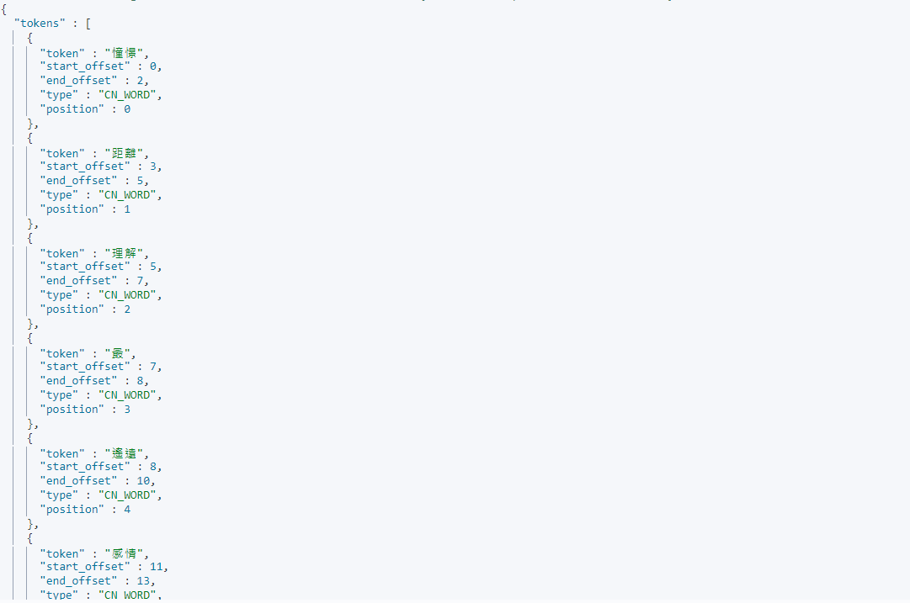

# Elasticsearch 中文分詞

在 Elasticsearch 中，中文分詞是一個非常特殊的存在，中文幾乎是不可能靠著原生的分析器做到合理的斷詞，所以我們必須借助一些其他的 Plugin 來幫助我們處理中文斷詞的問題，以下紀錄一下安裝以及使用 IK Analysis 的過程

:blue_book: Reference

* [ik 分詞器](https://github.com/medcl/elasticsearch-analysis-ik)
* [ik 繁體](https://github.com/sunghau/elasticsearch-analysis-ik-config-traditional-chinese) 網路上能搜到的大多是以這個為繁體字庫，但有點舊了上次更新是 2015...
* 有 survey 到用中研院的分詞 CKIP Lab，不過沒有支持 Elasticsearch 擴充，要自己打API去分詞再把分詞結果寫進 ES 裡面，然後一邊建立字庫
* [結巴分詞](https://github.com/sing1ee/elasticsearch-jieba-plugin)

## 安裝 analysis-ik

* 到上方的連結下載相對應 Release 版本，這邊使用 elasticsearch-analysis-ik-7.17.1
* 接著在安裝 Elasticsearch 的目錄下找到 plugins

  ```sh
  root@646ef2f0ce45:/usr/share/elasticsearch# ls
  LICENSE.txt  NOTICE.txt  README.asciidoc  bin  config  data  jdk  lib  logs  modules  plugins
  root@646ef2f0ce45:/usr/share/elasticsearch# cd plugins/
  root@646ef2f0ce45:/usr/share/elasticsearch/plugins# pwd
  /usr/share/elasticsearch/plugins
  ```

* 將下載的 elasticsearch-analysis-ik-7.17.1 解壓縮後加到 plugins 這個資料夾下
* 這邊我的 Elasticsearch 使用 Docker 搭建，再啟動 Container 的時候已經將 plugins 掛載到本機下面了  
  

* 找到掛載的路徑直接貼上  
  

* 進到容器中察看，如果有成功對應會出現 `elasticsearch-analysis-ik` 這個資料夾

  ```sh
  root@646ef2f0ce45:/usr/share/elasticsearch/plugins# ls 
  elasticsearch-analysis-ik
  ```

* 接著到 `/usr/share/elasticsearch/bin` 這個路徑底下，執行 `elasticsearch-plugin list`，列出所有 plugins 會看到 elasticsearch-analysis-ik

  ```sh
  root@646ef2f0ce45:/usr/share/elasticsearch/bin# elasticsearch-plugin list
  elasticsearch-analysis-ik
  ```

* 重啟容器 或 Elasticsearch 確保 Plugins 已經註冊

## 測試 IK 分詞

比較一下 Ik 分詞 `analysis-ik` 跟 內置分詞 `standard` 的區別

* 使用 `standard` 分析器

  ```sh
  GET /_analyze/
  {
    "analyzer": "standard",
    "text": "憧憬是距離理解最遙遠的感情"
  }
  ```

  

  輸出:

  ```JSON
  [ "憧","憬","是","距","離","理","解","最","遙","遠","的","感","情" ]
  ```

  基本上用預設的分析器來對中文做分詞，不管以什麼角度來說都不太對勁

* 使用 `analysis-ik` IK分詞
  
  ```JSON
  GET /_analyze/
  {
    "analyzer": "ik_max_word",
    "text": "憧憬是距離理解最遙遠的感情"
  }
  ```

  

  輸出:

  ```JSON
  [ "憧憬","是","距","離","理解","最","遙","遠","的","感情" ]
  ```

  結果看起來是有按照一的中文詞彙分詞了，但還是感覺哪裡不太對勁，其原因是 ik 分詞本身的字庫是簡體中文，若我們要用繁體中文需要更新一下字庫

## 安裝  analysis-ik 繁中

* 一樣到上方的 [ik繁體] 連結中把整個 Repository 拉下來

* 拉下來打開資料夾長這樣，這邊關注紅色框的兩個檔案  
  

* `IKAnalyzer.cfg.xml` 為 `IK Analyzer 扩展配置`，在設定中會把字典指向 custom 資料夾擴展的繁體分詞字典就放在 `custom` 裡面

* 設置 IK 繁體擴展，在這個路徑下面 `/usr/share/elasticsearch/plugins/elasticsearch-analysis-ik/config`，會看到 `IKAnalyzer.cfg.xml` 這個 XML 檔，我們要做的就是把剛剛下載的檔案複製過來  

  

* 加入擴展檔案，plugins裡面的IK分詞會如下圖  
  
  

## 測試 IK繁體 分詞

* 使用 IK繁體 分詞
  
  ```JSON
  GET /_analyze/
  {
    "analyzer": "ik_max_word",
    "text": "憧憬是距離理解最遙遠的感情"
  }
  ```

    

  輸出:

  ```JSON
  [ "憧憬","憧","憬","距離","距","離","理解","理","最","遙遠","遙","遠","感情","感","情" ]
  ```

  這個就可以看到分析器準確地命中，`憧憬`;`距離`;`理解`;`遙遠`;`感情`，這幾個單詞，代表剛剛設定的繁體中文字典已經被加進分析器中

## 使用中文分詞

在 IK Analysis 的文件裡面明確指出 IK Analysis 裡面有兩種 `Analyzer`
> Analyzer: ik_smart , ik_max_word , Tokenizer: ik_smart , ik_max_word
兩個的差異是 ik_smart 僅解析出字詞，ik_max_word 會將所有的分詞結果盡可能地列舉出來，如下  

* ik_smart

  這是使用 ik_smart 的效果

  ```JSON
  GET /_analyze/
  {
    "analyzer": "ik_smart",
    "text": "憧憬是距離理解最遙遠的感情"
  }
  ```

  

  輸出:

  ```JSON
  [ "憧憬","距離","理解","最","遙遠","感情"]
  ```

* ik_max_word

  這是使用 ik_max_word 的效果(跟上面測試時的效果一樣)

  ```JSON
  GET /_analyze/
  {
    "analyzer": "ik_max_word",
    "text": "憧憬是距離理解最遙遠的感情"
  }
  ```

  輸出:

  ```JSON
  [ "憧憬","憧","憬","距離","距","離","理解","理","最","遙遠","遙","遠","感情","感","情" ]
  ```

* Mapping Ik 分詞

  使用 _mapping 便可以指定 field 使用 IK Analysis

  ```JSON
  PUT /ikanalyzertest/_mapping
  {
    "properties":{
      "title":{
        "type":"text",
        "analyzer":"ik_max_word"
      }
    }
  }
  ```

## 更新字典

## 抓取遠端字典

有用到會來更新

## 結巴分詞

待續
