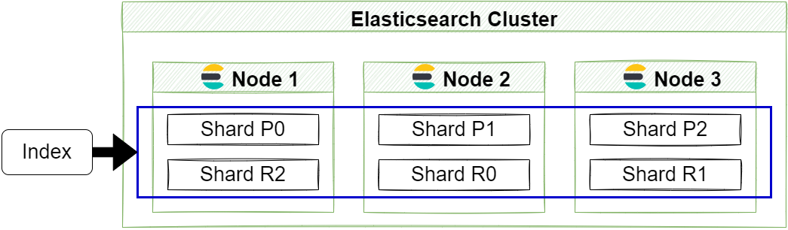

# Elasticsearch Index

:green_book: **Chapter Objectives**

* 索引的基本
* 基本API的使用

:blue_book: **Reference**

* [官方文件](https://www.elastic.co/guide/en/elasticsearch/reference/current/indices.html)
* [Terminology](https://www.elastic.co/guide/en/elastic-stack-glossary/current/terms.html#i-glos)
* [What is an Elasticsearch Index?(2013)](https://www.elastic.co/blog/what-is-an-elasticsearch-index)

:closed_book: **Notice**

基本上能看官方文件就去看，沒有人會比官方更懂他們的產品

## Basic Definition

> An index is like a ‘database' in a relational database.  
> It has a mapping which defines multiple types.
> An index is a logical namespace which maps to one or more primary shards and can have zero or more replica shards.

* <font color="63C5DA">**類似關聯式資料庫的 database**</font>
* <font color="63C5DA">**必須透過 mapping 定義 types**</font>
* <font color="63C5DA">**Index 是對一個"概念"的命名，Index 這個概念基本上包含一到多個 primary shards (分片)還有 零到多個 replica shards (副本)**</font>

官方公式書裡面提到對 `Index` 的定義:  

* > Collection of JSON documents.
* > To add one or more JSON documents to Elasticsearch. This process is called indexing.

有兩件事都叫 `Index` ，在閱讀原文文件時可能要區分一下:

* <font color="63C5DA">**一個是實體的 JSON documents 之集合**</font>
* <font color="63C5DA">**一個是動作把 JSON documents 加入 Elasticsearch 這件事**</font>

在 Elasticsearch 中 `Index` 為多個 Document 的集合，而 `Document` 又是多個 `fields` 的集合，  
每個索引都可有自己的 `mapping`，mapping 會決定 `Document` 中每個 `fields` 的名稱與類型；  
在 ES 中 `index` 也可以分布在不同的 `Shard` 上，來達到儲存空間的水平擴展，以系統架構的角度可以這樣看:  
&nbsp;  

&nbsp;  

官方 Index APIs 文件上將 Index 分成幾個小節:  

* <font color="63C5DA" size="4">**Index management**</font>
* <font color="63C5DA" size="4">**Mapping management**</font>
* <font color="63C5DA" size="4">**Alias management**</font>
* <font color="63C5DA" size="4">**Index settings**</font>
* <font color="63C5DA" size="4">**Index templates**</font>
* <font color="63C5DA" size="4">**Monitoring**</font>
* <font color="63C5DA" size="4">**Status management**</font>
* <font color="63C5DA" size="4">**Dangling indices**</font>

依自身的經驗談，若要最快速上手 :

`Index management`   : 必須先掌握，畢竟他是最基礎的 Index CURD  
`Mapping management` : 若已經有一些應用要實作，需要掌握這個，才能指定一些 Mapping 相關的設計  
`Alias management`   : 有很多的 Index 需要管理時，或者需要 ReIndex  
* ~~其他等我真的用到再回來補 ﾚ(ﾟ∀ﾟ;)ﾍ=З=З=З~~

## Index API

## Create index API

* 創建索引

    Request: `PUT /<index>`

    ```sh
    PUT /book-index-0001
    ```

    Result:

    ```JSON
    {
        "acknowledged" : true,
        "shards_acknowledged" : true,
        "index" : "book-index-0001"
    }
    ```

* 可以透過 Index body 設定的選項

  * aliases 別名;傳送門
  * mappings 映射;概念類似SQL中的Schema;傳送門
  * settings 索引設置 replicas; shard;
  
  簡單的使用

    ```sh
    PUT /book-index-0002
    {
        "settings": {
            "number_of_shards": 2,
            "number_of_replicas": 2
        },
        "mappings": {
            "properties": {
                "title": { "type": "object" }
            }
        }
    }
    ```

    Result:

    ```JSON
    {
        "acknowledged" : true,
        "shards_acknowledged" : true,
        "index" : "book-index-0002"
    }
    ```

* 索引命名原則
  * Lowercase only(只能小寫)
  * Cannot include \, /, *, ?, ", <, >, |, ` ` (space character), ,, #(不能包含這些字元)
  * Cannot start with -, _, +
  * Cannot be . or ..
  * Cannot be longer than 255 bytes (note it is bytes, so multi-byte characters will count towards the 255 limit faster)(涉及底層設計不能超過 255 bytes)

## Delete index API

* 刪除索引

    Request: `DELETE /<index>`

    >To delete all indices, use _all or * . To disallow the deletion of indices with _all or wildcard expressions, set the action.destructive_requires_name cluster setting to true.

    可以使用 _all 或 * 刪除所有索引，可以在某個設定中設定禁止此類型操作

    ```sh
    DELETE /book-index-0002
    ```

    Result:

    ```JSON
    {
        "acknowledged" : true
    }
    ```

## Get index API

* 檢視某個索引
  
  Request: `GET /<target>`

    ```sh
    GET /book-index-0001
    ```

    Result:

    ```JSON
    {
        "book-index-0001" : {
            "aliases" : { },
            "mappings" : { },
            "settings" : {
                "index" : {
                    "routing" : {
                        "allocation" : {
                            "include" : {
                            "_tier_preference" : "data_content"
                            }
                        }
                    },
                    "number_of_shards" : "1",
                    "provided_name" : "book-index-0001",
                    "creation_date" : "1656515329424",
                    "number_of_replicas" : "1",
                    "uuid" : "7DdAjOwdSlmXGuX7dKp_9g",
                    "version" : {
                        "created" : "7170199"
                    }
                }
            }
        }
    }
    ```

## Listed indices

* 列出索引
  
  使用 cat API Request: `GET /_cat/indices`
    ```sh
        yellow open mybeat-2022.06.27               9SdlB48_RaKldQRgBQhKhg 1 1  7    0   243kb   243kb
        green  open .geoip_databases                1cJrOdYzQruU1fc_A5o3Hw 1 0 40   77  75.9mb  75.9mb
        yellow open mybeat-2022.06.28               fItzFNKkRSiLJzWEFSxMzg 1 1  2    0  69.4kb  69.4kb
        green  open .apm-custom-link                UE04kRu1Q32E23P9o2aHWg 1 0  0    0    226b    226b
        yellow open book-index-0001                 7DdAjOwdSlmXGuX7dKp_9g 1 1  0    0    226b    226b
        green  open .apm-agent-configuration        5H2_N1KXQEyAczk8Szpq5w 1 0  0    0    226b    226b
        yellow open movie-index-000001              Y29WUJ1JRZurwFxrCWETBA 1 1  0    0    226b    226b
        green  open .kibana_task_manager_7.17.1_001 fG9VCeHmTS6i5zrUAPzj4A 1 0 17 5910 879.9kb 879.9kb
        green  open .kibana_7.17.1_001              h3kEcPD0RhWmRKYdSlATOQ 1 0 37    3   4.7mb   4.7mb
        yellow open mybeat-2022.06.26               mEBdUe-wRum4gI-VxhSsuA 1 1  4    0 138.6kb 138.6kb
        green  open .tasks                          kh3_uU9iQJmofYrXL7DslQ 1 0 16    0  55.7kb  55.7kb
    ```

## Rename Index

基本上滿麻煩的先使用 Clone Index API 再把原來的 Delete Index API