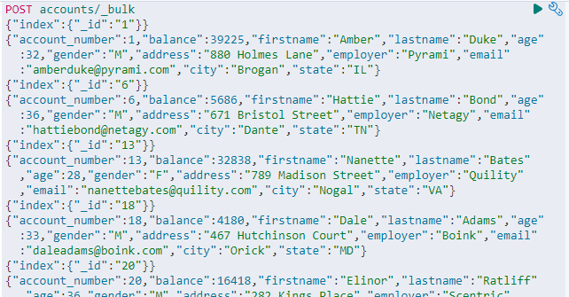
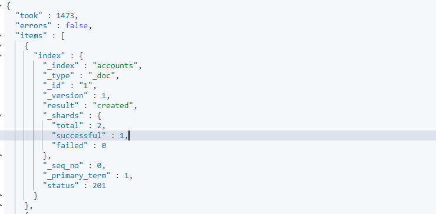
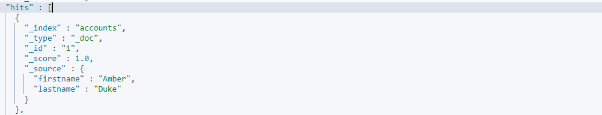

# Elasticsearch SearchAPI

在 Elasticsearch 體系中若要搜尋已經入檔的資料，我們需要透過 SearchAPI 結合 Elasticsearch 的特色語法 Query DSL 來進行查詢 (其實也有 SQL API，不過基於人類的好奇心，還是先從 DSL 入門吧)，本章記錄自己閱讀 Elasticsearch 搜尋相關文件的小整理(全部真的太多了...搜尋很大一章)

:blue_book: Reference

* [Search APIs 文件](https://www.elastic.co/guide/en/elasticsearch/reference/current/search.html)
* [Query DSL 文件](https://www.elastic.co/guide/en/elasticsearch/reference/current/query-dsl.html)
* [URI Search](https://www.elastic.co/guide/en/elasticsearch/reference/7.4/search-uri-request.html)
* [測試資料來源自官方的 github 請安心食用](https://github.com/elastic/elasticsearch/blob/v6.8.18/docs/src/test/resources/accounts.json)

## Elasticsearch 資料搜尋

Elasticsearch 中的資料搜尋的請求模式，基本上可以分成兩種模式:

* 以 `GET` 為主，以 `Uri` + `Parameter` 發送查詢請求
* 以 `GET` 或 `POST` 為主要 Method，以 `Uri` + `Request body` 發送查詢請求

通常網路社群上使用的大多都是使用第二種，但第一種也簡單過一下知道怎麼用，畢竟有時候如果只是一些簡單的查詢也是挺方便的，順便餵一下測試資料  

若以取得的查詢結果區分也分

* Query 一般查詢
* aggregations

## 準備測資

* 官方測資
  
  使用官方提供的 `accounts.json` 來試著玩耍查詢

* 使用 Bulk 倒入資料
  
  直接複製官方的文件貼上即可，基本上就是用 bulk 去 indexed  
  

  倒入資料後的結果，這邊 error 這個欄位會顯示 false，即為倒入過程沒有發生錯誤，在實際的應用場景中，判斷 error 這個欄位是 true 的話，才會去尋訪回傳的陣列是哪一筆資料出錯  
  

  cat 索引文件數量查文件

  ```JSON
  GET _cat/indices/accounts?v
  ```

  ```sh
  health status index    uuid                   pri rep docs.count docs.deleted store.size pri.store.size
  yellow open   accounts Ui3hF3e9TTuRklLJxtTz9w   1   1       1000            0    374.6kb        374.6kb
  ```
  
  docs.count = 1000 共引入 1000 筆測試資料，測試資料結構如下:

  ```JSON
  {
    "account_number" : 1,
    "balance" : 39225,
    "firstname" : "Amber",
    "lastname" : "Duke",
    "age" : 32,
    "gender" : "M",
    "address" : "880 Holmes Lane",
    "employer" : "Pyrami",
    "email" : "amberduke@pyrami.com",
    "city" : "Brogan",
    "state" : "IL"
  }
  ```

## 使用 URI Search 查詢

>Allows you to execute a search query and get back search hits that match the query. You can provide search queries using the q query string parameter or request body.

可以根據您輸入的查詢條件返回命中的資料，你可以藉由 parameter `q` 或使用 `request body` 來進行搜尋，來自官方文件的說明，這邊先試試 parameter `q`

我們可以用以下方法來進行查詢

```JSON
GET <index>/_search?<parameter>
```

### 查指定

查指定 field，結果只顯示指定的 field

```JSON
GET accounts/_search?_source=firstname,lastname
```



### 查條件

* 指定 field equal
查 lastname 為 Duke

```JSON
GET accounts/_search?q=lastname:Duke
```

* NOT 用法

```JSON
GET accounts/_search?q=NOT state:HI
```

* AND 用法
查 firstname Claudia為 且 lastname 為 Terry

```JSON
GET accounts/_search?q=firstname:Claudia AND lastname:Terry
```

* 數字或時間區間
查區間的用法詳細請看至頂的官方文件 Query string query 這份裡面的 Ranges 有超詳細說明(大概)

```JSON
GET accounts/_search?q=age:[20 TO 25]
```

```JSON
GET accounts/_search?q=age:[20 TO 25}
```

```JSON
GET accounts/_search?q=age:[* TO 25}
```

* OR 用法

```JSON
GET accounts/_search?q=city:("Bannock" or "Bethany")
```

```JSON
GET accounts/_search?q=(age:20 or gender:M) 
```

* 加權用法

```JSON
GET accounts/_search?q=(age:20^5 or gender:M) 
```

### 查排序

```JSON
GET accounts/_search?sort=age:asc
```

```JSON
GET accounts/_search?sort=age:desc
```

### 查分頁

* Size 用法

```JSON
GET accounts/_search?sort=account_number:asc&size=5
```

* From 用法

```JSON
GET accounts/_search?sort=account_number:asc&from=5&size=5
```

### 範例合集

```s
GET accounts/_search?_source=firstname,lastname
GET accounts/_search?q=lastname:Duke
GET accounts/_search?q=firstname:Claudia AND lastname:Terry
GET accounts/_search?q=age:[20 TO 25]
GET accounts/_search?q=age:[20 TO 25}
GET accounts/_search?q=age:[* TO 25}
GET accounts/_search?q=city:("Bannock" or "Bethany")
GET accounts/_search?q=(age:20 or gender:M) 
GET accounts/_search?q=(age:20^5 or gender:M) 
GET accounts/_search?sort=age:asc
GET accounts/_search?sort=age:asc&_source=firstname,lastname
GET accounts/_search?sort=account_number:asc&size=5
GET accounts/_search?sort=account_number:asc&from=5&size=5
GET accounts/_search?q=NOT state:HI
```

## 查詢計畫

`"profile": true`  
暫時不想研究，先放著
