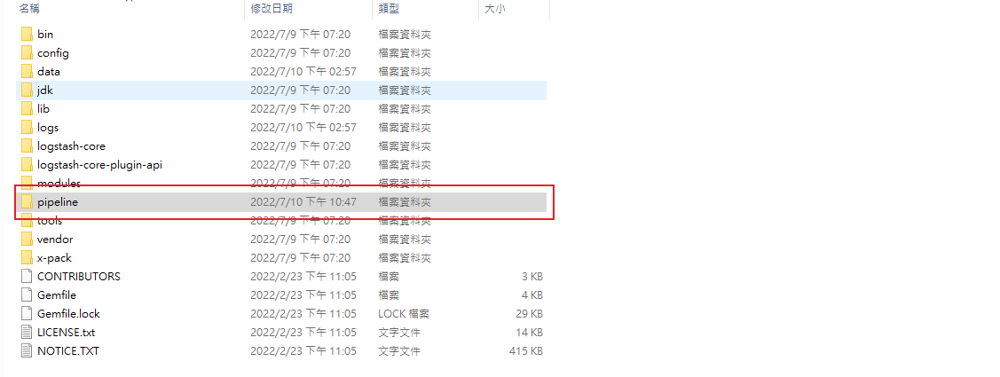
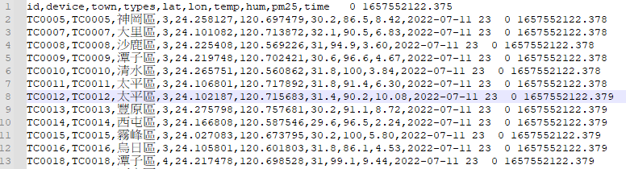
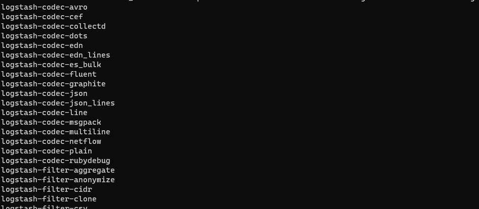
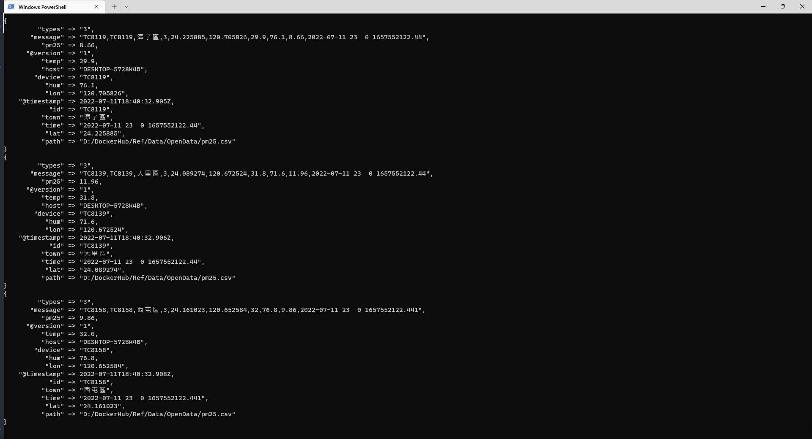
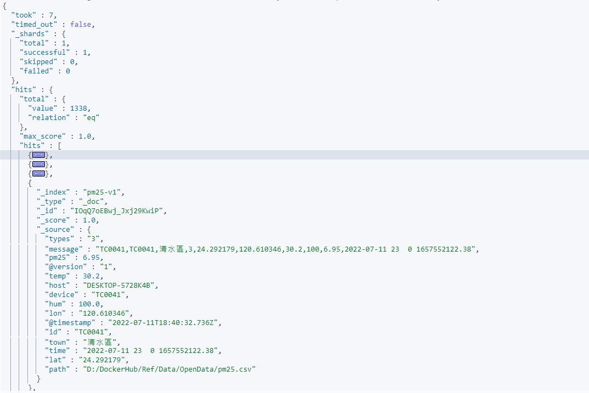
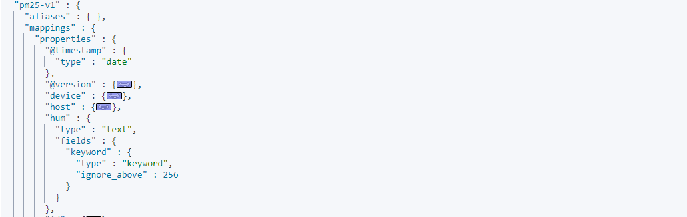
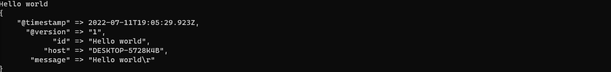
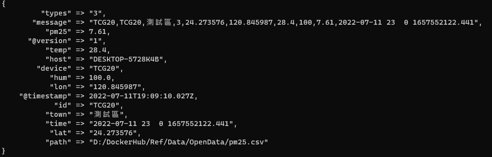

# Logstash 匯出 CSV

Logstash 擅長將各式的資料倒入 Elasticsearch 中，此篇記錄一下使用 Logstash 將 CSV 中的資料匯入 elasticsearch 中的過程

📘 Reference

* [官方文件](https://www.elastic.co/guide/en/logstash/current/index.html)
* [kaggle 數據建模和數據分析平台](https://www.kaggle.com/)
* [Mutate filter plugin](https://www.elastic.co/guide/en/logstash/current/plugins-filters-mutate.html#plugins-filters-mutate-convert)
* [Csv filter plugin](https://www.elastic.co/guide/en/logstash/current/plugins-filters-csv.html)

## 事前準備工作

* 先下載 Logstash 本文使用版本 logstash-7.17.1-windows 版本
* 找到一份 CSV 格式的資料，以`,`分隔資料，並有完整斷行
* 解壓縮後內容如下:  
  
* 在資料夾底下新增一個 `pipeline` 的資料夾之後用來存放 pipeline 設定檔
* 以下為本文測試資料來至 Opendata pm2.5 csv 資料集結構如下:  
  

## Pipeline

準備好之後來編寫第一個 pipeline

### pm25csv.conf

在 `pipeline` 這個資料夾底下新增一個 pm25csv.conf 文件，文件內容如下:

```JSON
input {
    file {
        path => "D:/DockerHub/Ref/Data/OpenData/pm25.csv"
        start_position => "beginning"
        sincedb_path=>"D:/DockerHub/Ref/Data/OpenData/pm25.log"
    }
    stdin {}
}
filter {
    csv {
        skip_header => true
        separator => ","
        columns => ["id","device","town","types","lat","lon","temp","hum","pm25","time"]
    }
}
output {
    elasticsearch { 
        hosts => ["http://localhost:9200/"]
        index => "pm25-v1"
    }
    stdout {}
}
```

* Logstash Pipline 的三大要素分別是 input; filter; output
* `Input` : 我們指定兩個 資料來源一個是 file ; 另一個是 stdin
  * `input stdin` 用來測試用的，下面會示範怎麼用
  * `input file path` 資料來源路徑
  * `input file start_position` 從甚麼位置開始讀取文件，Logstash預設是結束位置，就是每次都拿最後一筆，這種預設的模式適合用在讀 log 的環 境，因為若是 log 的話每次一筆新的日誌總是會添加在文件最後。而這邊我們導入的是整個 csv 文件所以讓 Logstash 從頭開始讀取設定為 `beginning` 當讀取到最末時，Logstash 將自動切換為預設模式 `End` 讀取最後一筆
  * `input file sincedb_path` 指定一個 log，這個 log 提供 Logstash `探針` 紀錄最後一筆讀取資料的偏移量，若不指定會自動產生，若不想紀錄請設為 `null`，為了方便管理大多時候建議還是紀錄一下

* `filter` : 這邊使用 `Csv filter plugin` 來做資料處理，文件請見置頂 Reference
  * `filter csv skip_header` 指定跳過標頭
  * `filter csv separator` 設定為 `","` 以逗號標示資料間隔
  * `filter csv columns` 每個欄位資料如何解析進 Elasticsearch

* `output` : 主要輸出資料的目的地 Stdout and Elasticsearch，使用 `Elasticsearch output plugin`，還有許多不同的 plugin 可以輸出資料到其他的載體
  * `output elasticsearch hosts` 預計輸出目標的 elasticsearch hosts
  * `output elasticsearch index` 預計輸出到哪個 index 下
  * `output stdout` 用來測試用的，下面會示範怎麼用

:warning: 這裡很重要 如果在 windows 環境下 `path => "D:/DockerHub/Ref/Data/OpenData/pm25.csv"` 路徑的正反斜線請注意  
&emsp;&emsp;&emsp;=> 這是 windows 輸出的路徑 `D:\DockerHub\Ref\Data\OpenData\pm25.csv` (這是錯的)  
&emsp;&emsp;&emsp;=> 這是 logstash 中約定的路徑 `D:/DockerHub/Ref/Data/OpenData/pm25.csv` (這是對的)  
&emsp;&emsp;&emsp;=> 下面那個才可以成功運作

## 匯入資料

### 實用指令

* 相關的指令集都在 `bin` 裡面可以直接呼叫，檢視 Logstash 中的 plugin

  ```sh
  .\bin\logstash-plugin list
  ```

  ```sh
    logstash-codec-avro
    logstash-codec-cef
    logstash-codec-collectd
    logstash-codec-dots
    logstash-codec-edn
    logstash-codec-edn_lines
    logstash-codec-es_bulk
    logstash-codec-fluent
    ...下略
  ```
  
  

* 確定使用到 plugin 都已經在列表裡面，如下
  * logstash-input-stdin
  * logstash-input-file
  * logstash-filter-csv
  * logstash-output-elasticsearch
  * logstash-output-stdout
  如果有缺，到官方去下載相對應版本的 plugin，但基本上應該都會有

### 啟動 Logstash 匯入資料
  
  使用指令啟動 Logstash，-f 後面指定編寫好的 pipeline config (還有一個方法是用 pipeline.yml 中，使用方法預計也會有一篇筆記)

  ```sh
    .\bin\logstash -f .\pipeline\pm25csv.conf
  ```
  
  若是啟動成功應該會看到資料一筆一筆的顯示在 terminal 上面，那是因為 pipeline `output stdout` 這個就是將輸出一併顯示在 terminal 上

  

### Kibana 查看結果
  
  使用 GET Index search 查看

  ```JSON
   GET pm25-v1/_search
  ```

  可以看到 pm25-v1 這個 index 中已經有 1338 筆資料

  

## Mutate filter plugin

雖然資料已經匯入成功了，但仔細觀察的話會發現有些問題，用 mapping 指定來查看 index mapping，會發現 "temp","hum","pm25" 這幾個欄位是 text ，在一般的應用我們更多時候希望這幾個欄位是以數值方式去對應，所以我們要修改一下 pipeline



對應的方法其實還有一種是一開始就先設定好 index 與 index mapping，這樣使用 Logstash 時只要將資料導入即可，不過這邊嘗試一下不用事先去建立 mapping 的方法，我們使用 mutate plugin 來處理，詳細文件見置頂( mutate 操作彈性滿大的)  

mutate plugin 提供了幾種資料型態對應 integer;integer_eu;float;float_eu;string;boolean，只要在 `filter` 中引入 `mutate plugin`

### 引入 mutate
  
  `filter mutate convert` 欄位 => 指定型別，就可以將數值轉型，最後設定檔如下

```JSON
    input {
        file {
            path => "D:/DockerHub/Ref/Data/OpenData/pm25.csv"
            start_position => "beginning"
            sincedb_path=>"D:/DockerHub/Ref/Data/OpenData/pm25.log"
        }
        stdin {}
    }
    filter {
        csv {
            skip_header => true
            separator => ","
            columns => ["id","device","town","types","lat","lon","temp","hum","pm25","time"]
        }
        mutate {
            convert => {
                "temp" => "float"
                "hum" => "float"
                "pm25" => "float"
            }
        }
    }
    output {
        elasticsearch { 
            hosts => ["http://localhost:9200/"]
            index => "pm25-v1"
        }
        stdout {}
    }
```

### 最終成果

  一樣把 mapping 提取出來檢視

  ```JSON
  GET pm25-v1/_mapping/field/hum,temp,pm25
  ```

  可以看到 hum,temp,pm25 這三個 field 都已經是 `"type" : "float"`

  ```JSON
  {
    "pm25-v1" : {
        "mappings" : {
            "hum" : {
                "full_name" : "hum",
                "mapping" : {
                    "hum" : {
                        "type" : "float"
                    }
                }
            },
            "temp" : {
                "full_name" : "temp",
                "mapping" : {
                    "temp" : {
                        "type" : "float"
                    }
                }
            },
            "pm25" : {
                "full_name" : "pm25",
                "mapping" : {
                    "pm25" : {
                        "type" : "float"
                    }
                }
            }
        }
    }
  }
  ```

## 補充

### Stdin

基本上這個也可以不用加，不過加了可以用來偵錯，這個可以讓 terminal 接收輸入，例如輸入 Hello world，就會插入一筆 Hello world 資料到指定的 index 中
  

### CSV 新資料

如果往 CSV 裡面新增資料的話，探針會繼續移動並將資料自動推送到 elasticsearch 中，增加一筆測試
  

### 重新載入

若要重新載入要將指針歸零，或是把 .log 直接刪除
