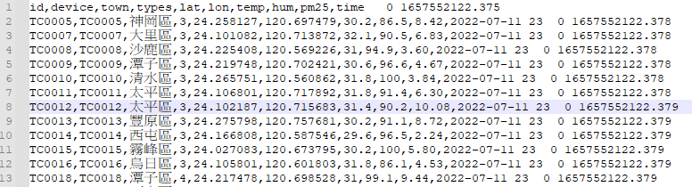

# Logstash 匯出 CSV

Logstash 擅長將各式的資料倒入 Elasticsearch 中，此篇記錄一下使用 Logstash 將 CSV 中的資料匯入 elasticsearch 中的過程

📘 Reference

* [官方文件](https://www.elastic.co/guide/en/logstash/current/index.html)
* [kaggle 數據建模和數據分析平台](https://www.kaggle.com/)
* [Mutate filter plugin](https://www.elastic.co/guide/en/logstash/current/plugins-filters-mutate.html#plugins-filters-mutate-convert)

## 事前準備工作

* 先下載 Logstash 本文使用版本 logstash-7.17.1-windows 版本
* 找到一份 CSV 格式的資料，以`,`分隔資料，並有完整斷行
* 解壓縮後內容如下:
  
* 在資料夾底下新增一個 `pipeline` 的資料夾之後用來存放 pipeline 設定檔
* 以下為本文測試資料來至 Opendata pm2.5 csv 資料集結構如下
  

## Pipeline

準備好之後來編寫第一個 pipeline

* pm25csv.conf
    在 `pipeline` 這個資料夾底下新增一個 pm25csv.conf 文件，文件內容如下:

    ```JSON
    input {
        file {
            path => "D:/DockerHub/Ref/Data/OpenData/pm25.csv"
            start_position => "beginning"
            sincedb_path=>"D:/DockerHub/Ref/Data/OpenData/pm25.log"
        }
        stdin {}
    }
    filter {
        csv {
            skip_header => true
            separator => ","
            columns => ["id","device","town","types","lat","lon","temp","hum","pm25","time"]
        }
    }
    output {
        elasticsearch { 
            hosts => ["http://localhost:9200/"]
            index => "pm25-v1"
        }
        stdout {}
    }
    ```

  * Logstash Pipline 的三大要素分別是 input;filter;output
  * 在 Input 的部分我們指定兩個 資料來源一個是 file ; 另一個是 stdin
  * `input stdin` 用來測試用的，下面會示範怎麼用
  * `input file path` 資料來源路徑
  * `input file start_position` 從甚麼位置開始讀取文件，Logstash預設是結束位置，就是每次都拿最後一筆，這種預設的模式適合用在讀 log 的環 境，因為若是 log 的話每次一筆新的日誌總是會添加在文件最後。而這邊我們導入的是整個 csv 文件所以讓 Logstash 從頭開始讀取設定為 `beginning` 當讀取到最末時，Logstash 將自動切換為預設模式 `End` 讀取最後一筆
  * `input file sincedb_path` 指定一個 log，這個 log 提供 Logstash `探針` 紀錄最後一筆讀取資料的偏移量，若不指定會自動產生，若不想紀錄請設為 `null`，為了方便管理大多時候建議還是紀錄一下
  * `filter csv skip_header`
  * `filter csv separator`
  * `filter csv columns`

  * `output elasticsearch hosts`
  * `output elasticsearch index`
  * `output stdout`

integer、integer_eu、float、float_eu、string、boolean

## Mutate filter plugin

```JSON
    input {
        file {
            path => "D:/DockerHub/Ref/Data/OpenData/pm25.csv"
            start_position => "beginning"
            sincedb_path=>"D:/DockerHub/Ref/Data/OpenData/pm25.log"
        }
        stdin {}
    }
    filter {
        csv {
            skip_header => true
            separator => ","
            columns => ["id","device","town","types","lat","lon","temp","hum","pm25","time"]
        }
        mutate {
            convert => {
                "temp" => "float"
                "hum" => "float"
                "pm25" => "float"
            }
        }
    }
    output {
        elasticsearch { 
            hosts => ["http://localhost:9200/"]
            index => "pm25-v1"
        }
        stdout {}
    }
```
