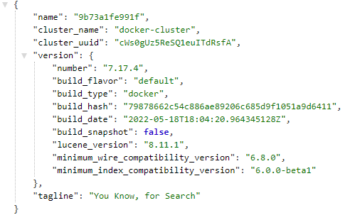
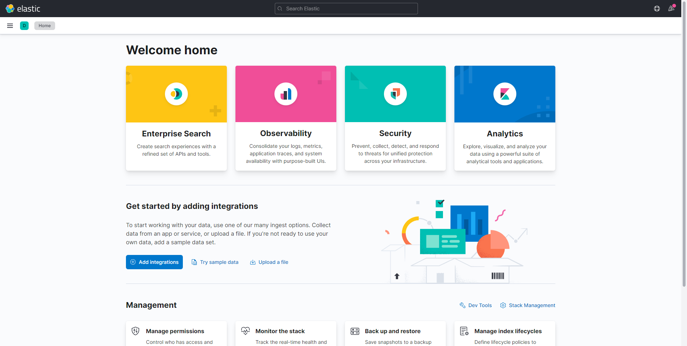
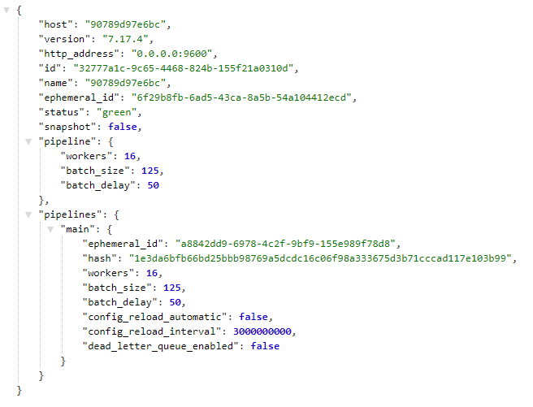
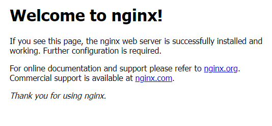

# Elastic stack 環境建置

為了輕鬆玩耍 Elastic Stack 需要先準備環境，以下紀錄一下自己用 Docker 搭建 Elastic Stack 各項服務的過程

:earth_asia: 環境

* OS Windows 10
* Docker Desktop 4.9.1
* Elastic stack 各項服務已 7.17.4 為主要版本號
* Using the WSL 2 backend

:earth_asia: 想參考此篇的你須具備 Docker 與編寫 Docker Compose 的相關知識，注意事項如下:

* 直接在 Windows 用指令建置環境實在太陰間(Docker bind amount 在 Window 環境下會有些許路徑問題)，所以最後產出將會是使用 Docker Compose 來啟動環境
* 請配置適合的記憶體空間給 Docker Desktop，Elastic Stack 需要一定的記憶體空間，請依據環境中的 Docker 配置此篇使用WSL2
* Docker Commands 傳送門 [https://docs.docker.com/engine/reference/commandline/docker/](https://docs.docker.com/engine/reference/commandline/docker/)

## 行前準備

已 WSL2 的基本配置大機率是啟動不了此篇 Elastic stack 的全部服務，配置一下 WSL2 的相關記憶體設定，在這個路徑下面添加設定檔(根據當下 Docker 環境設定記憶體)

 `C:\Users\{UserName}\.wslconfig`

設定檔裡面添加記憶體 (memory) 的設定

```EditorConfig
[wsl2]
memory=4GB
```

WSL2幾個實用指定:

* View the list of distros and their current state : `wsl -l -v`
* Shutdown everything : `wsl --shutdown`
* Boot up the default distro : `wsl`
* Boot up a specific distro : `wsl -d <DistroName>`

## Elastic stack 最基本架構

1. Elasticsearch

    做為整個 Elastic stack 服務的核心，一個以 Lucene 為基礎實現的全文索引 NoSQL 資料庫，最終所有的資料與數據將在此處持久化
2. Kibana

    此服務提供 UI 介面來操作持久化在 Elasticsearch 中的資料，並提供視覺化儀表板，另外也可以作為管理 Elastic stack 相關服務的後台
3. Logstash

    通常出現 Elasticsearch 之前，用於數據再倒入 Elasticsearch 之前，將資料清洗並輸入，主要由三個部分組成分別是 Input > Filter > Output，之後會再 Logstash 的設定中看到
4. FileBeat

    其原始稱呼其實為 "Beats"，用於將資料傳輸至 Elasticsearch 或 Logstash，這邊使用 FileBeat， Elastic stack 中 "Beats" 的總類有很多種常見的有 Metricbeat、Filebeat、WinLogBeat、Heartbeat......等等，可以依需求使用相應的 "Beats"
5. NGINX(非Elastic stack)

    一個非同步框架的網頁伺服器，非 Elastic stack 只是這邊Demo架構需要一個資料提供者較容易展示結果，這裡會將 NGINX 中的 Log 藉由 FileBeat 傳送至 Logstash，之後將持久化至 Elasticsearch 並由 Kibana 來展示數據

## 用 Docker 建置 Elastic stack

以下使用 Docker 來建置 Elastic stack，在搭建服務之前需要先創建一個 docker network，之後建置的服務都會使用這個 Network 來溝通;以 Birdge 模式創建一個名為 elknetwork 的 Docker network

`docker network create elknetwork`

接下來我們一次把需要的 Image 都拉取下來，一個沉重的建議，在同一個應用下，版本號"盡量全部統一"，官方的倉庫走這邊 [https://www.docker.elastic.co/](https://www.docker.elastic.co/)，要從 Docker hub 上拉取也是可以

* Elasticsearch : `docker pull docker.elastic.co/elasticsearch/elasticsearch:7.17.4`
* Kibana : `docker pull docker.elastic.co/kibana/kibana:7.17.4`
* Logstash : `docker pull docker.elastic.co/logstash/logstash:7.17.4`
* Filebeat : `docker pull docker.elastic.co/beats/filebeat:7.17.4`
* NGINX(直接抓最新版本) : `docker pull nginx`

拉取成功的話長這樣

```sh
D:\DockerHub\ELK>docker images
REPOSITORY                                      TAG       IMAGE ID       CREATED       SIZE
nginx                                           latest    0e901e68141f   3 weeks ago   142MB
docker.elastic.co/elasticsearch/elasticsearch   7.17.4    d64cccab426e   4 weeks ago   630MB
docker.elastic.co/beats/filebeat                7.17.4    7675b1be93e0   4 weeks ago   280MB
docker.elastic.co/logstash/logstash             7.17.4    93aa11296788   4 weeks ago   798MB
docker.elastic.co/kibana/kibana                 7.17.4    86967a98433b   4 weeks ago   821MB
```

方丈為人比較小心眼，先各自啟動看看是不是能正常運作，再來編寫 Docker Compose 文件處理持久化跟設定，直接下 `docker run` 啟動看看:

1. Elasticsearch :
    1. 先以單節點模式啟動 Elasticsearch ; docker 指令

        ```sh
        docker run -d ^
        --name myelasticsearch ^
        --network elknetwork ^
        -p 9200:9200 ^
        -e "discovery.type=single-node" ^
        docker.elastic.co/elasticsearch/elasticsearch:7.17.4
        ```

    2. 啟動後至 `http://localhost:9200/` 察看結果，看到以下畫面就是啟動成功了"You Know, for Search"  
        

2. Kibana
    1. 以上面啟動的 Elasticsearch 為 Host 啟動 Kibana; 兩個要點注意--network是否橋接到同一個網路介面，`ELASTICSEARCH_HOSTS=http://myelasticsearch:9200` 以當下的創建的 elasticsearch 服務為準

        ```sh
        docker run -d ^
        --name mykibana ^
        --network elknetwork ^
        -p 5601:5601 ^
        -e "ELASTICSEARCH_HOSTS=http://myelasticsearch:9200" ^
        docker.elastic.co/kibana/kibana:7.17.4
        ```

    2. 啟動後至 `http://localhost:5601/` 察看結果，若啟動成功會看到以下介面  
        

3. Logstash
    1. 啟動 Logstash 這邊會映射兩個 port 號，5044 這是 default beats port; 9600 是給 Web API 使用的

        ```sh
        docker run -d ^
        --name mylogstash ^
        --network elknetwork ^
        -p 5044:5044 ^
        -p 9600:9600 ^
        docker.elastic.co/logstash/logstash:7.17.4
        ```

    2. 啟動後至 `http://localhost:9600/_node/pipelines?pretty` 應該會看到一個預設的 pipelines  
        

4. Filebeat
    1. 啟動 Filebeat -strict.perms=false 不檢查配置文件 es.yml

        ```sh
        docker run -d ^
        --name myfilebeat ^
        --network elknetwork ^
        --user=root ^
        -e -strict.perms=false ^
        docker.elastic.co/beats/filebeat:7.17.4
        ```

    2. 由於沒有映射 Port 到容器外面這邊可以使用 `docker logs [Container]` 查一下 Log 輸出
        啟動成功應該會在 Log 中看到以下字眼  
        

5. NGINX
    1. 毫無反應就是一個 NGINX 直接無情啟動

        ```sh
        docker run -d ^
        --name mynginx ^
        --network elknetwork ^
        -p 7414:80 ^
        nginx
        ```

    2. 訪問 `http://localhost:7414/` Welcome to nginx!  
        

6. 小結

   全部啟動後檢查一下結果 Docker 中會有5個容器，以下的都用不到...; 接下編寫 Docker Compose 用於啟動一個簡單的 Elastic Stack ; 我們需要額外設定的東西主要有兩項:

   ```sh
   C:\Users\mobet>docker ps
    CONTAINER ID   IMAGE                                                  COMMAND                  CREATED          STATUS          PORTS                                            NAMES
    0e09f4cb368c   nginx                                                  "/docker-entrypoint.…"   8 minutes ago    Up 8 minutes    0.0.0.0:7414->80/tcp                             mynginx
    9f4dfcaa3db0   docker.elastic.co/kibana/kibana:7.17.4                 "/bin/tini -- /usr/l…"   15 minutes ago   Up 15 minutes   0.0.0.0:5601->5601/tcp                           mykibana
    a76d14ccd71d   docker.elastic.co/beats/filebeat:7.17.4                "/usr/bin/tini -- /u…"   15 minutes ago   Up 15 minutes                                                    myfilebeat
    90789d97e6bc   docker.elastic.co/logstash/logstash:7.17.4             "/usr/local/bin/dock…"   30 minutes ago   Up 30 minutes   0.0.0.0:5044->5044/tcp, 0.0.0.0:9600->9600/tcp   mylogstash
    ab772cb2f745   docker.elastic.co/elasticsearch/elasticsearch:7.17.4   "/bin/tini -- /usr/l…"   44 minutes ago   Up 44 minutes   0.0.0.0:9200->9200/tcp, 9300/tcp                 myelasticsearch
   ```

   * 將 Elastic Stack 中必要的資料持久化至硬碟(windows 環境下直接用 docker 指令做 bind mounts 真得太過陰間...)
   * 將 Elastic Stack 需要使用的設定檔 Bind 到指定的實體位置，方便修改
   * 添加一些更詳細的設定
   * 下章節用 Docker Compose 來建置環境
