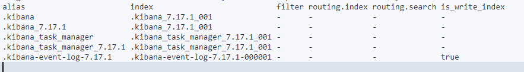

# Elasticsearch Aliases

本章紀錄 Elasticsearch Aliases (別名)，以下為官方文件靈魂說明，基本上靈力值太低的我根本看不懂...

> An alias is a secondary name for a group of data streams or indices. Most Elasticsearch APIs accept an alias in place of a data stream or index name.
>
> You can change the data streams or indices of an alias at any time. If you use aliases in your application’s Elasticsearch requests, you can reindex data with no downtime or changes to your app’s code.

為什麼要對索引使用 Alias，自身理解

* 靈活性
* 方便修改 Mapping
* 如同關聯型資料庫中的 View 表

使用場景如下

:star: 以下打一百個星號 :star: * 100

在 elasticsearch 中別名有兩種，**在查資料的時候先確定文章是在說哪種 alias**，這一篇是紀錄  index alias，在官方文件中

* [Aliases](https://www.elastic.co/guide/en/elasticsearch/reference/current/aliases.html) 這是給 data stream alias 和  index alias 用的
* [Alias field type](https://www.elastic.co/guide/en/elasticsearch/reference/current/field-alias.html) 這是給 field 用的，是一種 field type

:blue_book: Reference

* 官方文件；[走這裡](https://www.elastic.co/guide/en/elasticsearch/reference/current/aliases.html)

## Index Alias 的使用


### 列出所有的 Alias

```sh
GET _cat/aliases?v
```



### 