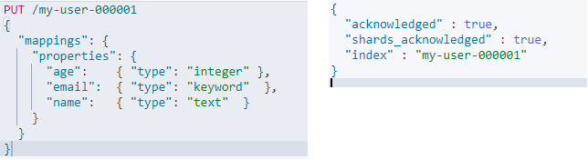
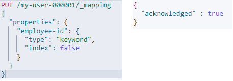
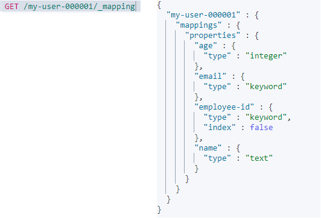
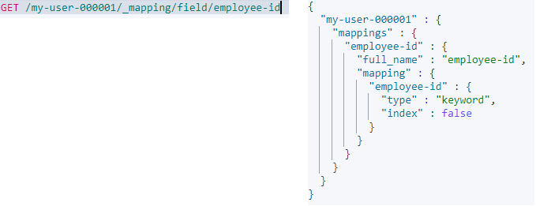

# Elasticsearch Mapping

在 Index 中的 Mapping 用來定義索引中的欄位名稱與類型，**相當於關聯型數據庫中創建Table時指定的 Schema**，但在 Elasticsearch 並不一定要指定 Index Mapping 才能儲存資料 Elasticsearch 其特有的 Dynamic Mapping 機制也可以根據鍵入的資料來生成相對應的 Mapping field

* 在創建索引時，順便設計類型就跟使用 SQL 一樣
* 關於 body 裡面可以設定的參數 [走這裡](https://www.elastic.co/guide/en/elasticsearch/reference/current/mapping-params.html)

## 如何使用 Index Mapping

在創建索引時;透過 "mappings" 來指定，Field data Type 可以看這邊 [官方文件](https://www.elastic.co/guide/en/elasticsearch/reference/current/mapping-types.html)

```sh
PUT /my-user-000001
{
  "mappings": {
    "properties": {
      "age":    { "type": "integer" },  
      "email":  { "type": "keyword"  }, 
      "name":   { "type": "text"  }     
    }
  }
}
```



* age 為 integer : 毫無反應；就是一個整數
* email 為 keyword : 若指定為 keyworld，將不會享有全文搜索的特性，單單視為普通參數做使用
    >Avoid using keyword fields for full-text search. Use the text field type instead.
* name 為 text : 若指定為 text，這個 Field 將會經過 `analysis` 分詞轉換為全文索引 analysis 是 Elasticsearch 中一個非常重要機制
    > A field to index full-text values, such as the body of an email or the description of a product. These fields are analyzed, that is they are passed through an analyzer to convert the string into a list of individual terms before being indexed.

## 添加新字段

添加一個 `employee-id` 的 `keyword` 字段，並指定其 index 的屬性為 false ; 當 index 屬性被指定為 false 時，通常代表這個 field (此處為 `employee-id`) 不會被建立索引或不可透過此字段進行查詢，僅是為了呈現數據而使用

```sh
PUT /my-user-000001/_mapping
{
  "properties": {
    "employee-id": {
      "type": "keyword",
      "index": false
    }
  }
}
```



## 更新字段

除了指定的 Mapping parameters (設定參數[這裡](https://www.elastic.co/guide/en/elasticsearch/reference/current/mapping-params.html))外，基本上**沒辦法更新**已經指定的 mapping 或 field type，更新已存在的 field 會造成索引失效，在 es 中索引是很敏感的存在
> Except for supported mapping parameters, you can’t change the mapping or field type of an existing field. Changing an existing field could invalidate data that’s already indexed.

但還是可以透過 reindex 與 alias 的機制來解決

## 查詢 mapping of an index

```sh
GET /my-user-000001/_mapping
```



## 查詢某個指定的 field

```sh
GET /my-user-000001/_mapping/field/employee-id
```

