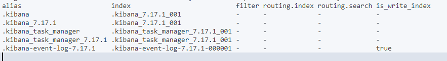
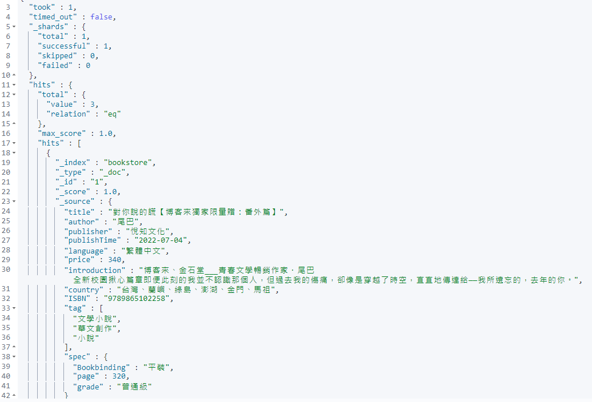
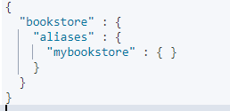
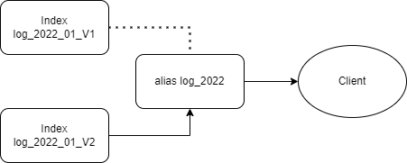

# Elasticsearch Aliases

本章紀錄 Elasticsearch Aliases (別名)，以下為官方文件靈魂說明，基本上靈力值太低的我根本看不懂...

> An alias is a secondary name for a group of data streams or indices. Most Elasticsearch APIs accept an alias in place of a data stream or index name.
>
> You can change the data streams or indices of an alias at any time. If you use aliases in your application’s Elasticsearch requests, you can reindex data with no downtime or changes to your app’s code.

為什麼要對索引使用 Alias，自身理解

* 靈活性
* 方便修改 Mapping
* 如同關聯型資料庫中的 View 表

:star: 以下打一百個星號 :star: * 100

在 elasticsearch 中別名有兩種，**在查資料的時候先確定文章是在說哪種 alias**，這一篇是紀錄  index alias，在官方文件中

* [Aliases](https://www.elastic.co/guide/en/elasticsearch/reference/current/aliases.html) 這是給 data stream alias 和  index alias 用的
* [Alias field type](https://www.elastic.co/guide/en/elasticsearch/reference/current/field-alias.html) 這是給 field 用的，是一種 field type

:blue_book: Reference

* 官方文件；[走這裡](https://www.elastic.co/guide/en/elasticsearch/reference/current/aliases.html)

## Index Alias 的使用情境

:crystal_ball: Alias Should Know

* 可以訂自請求範圍，如同 MySQL & MSSQL View
* 使用 Alias Reindex

:blue_book: 測試操作步驟

* 先建入 Template 資料 : Index為 bookstore 與三筆測試資料
* 對 Index bookstore 增加 mybookstore alias
* 對 mybookstore alias 使用 alias filter
* 簡單的試一下 Reindex

### 用貓列出所有的 Alias

```sh
GET _cat/aliases?v
```



## 新增、更新 Index Alias

[官方文件](https://www.elastic.co/guide/en/elasticsearch/reference/7.17/indices-add-alias.html)

* 新增與更新的方法

  * `POST <target>/_alias/<alias>`
  * `POST <target>/_aliases/<alias>`
  * `PUT <target>/_alias/<alias>`
  * `PUT <target>/_aliases/<alias>`

    ```sh
    PUT bookstore/_alias/mybookstore
    ```

    ```JSON
    {
        "acknowledged" : true
    }
    ```

* 使用 Alias 查詢 Index 來得到快樂

    ```sh
    GET mybookstore/_search
    ```

    

## 查詢 alias

* `GET _alias/<alias>` 拿搜尋
* `GET _alias` 全部拿
* `GET <target>/_alias/<alias>` 在某個Index下拿

  ```sh
  GET bookstore/_alias/*
  GET bookstore/_alias/mybookstore
  ```

  

## 刪除 alias

* `DELETE /<index>/_alias/<alias>`
* `DELETE /<index>/_aliases/<alias>`

  ```sh
  DELETE /bookstore/_alias/mybookstore
  ```

  ```JSON
  {
      "acknowledged" : true
  }
  ```

## Aliases API (類似檢視表用法)

> Performs one or more alias actions in a single atomic operation.

透過原子操作來設定 Aliases，當成類似檢視表的功能只取出，只取出規格為320頁的書籍

```sh
POST _aliases
{
    "actions": [
    {
      "add": {
        "index": "bookstore",
        "alias": "mybookstore",
        "filter": { "match": { "publisher": "悅知文化" } }
      }
    }
  ]
}
```

用 alias 進行搜尋

```sh
GET /mybookstore/_search
```

```JSON
{
  "hits" : [
        {
          "_index" : "bookstore",
          "_type" : "_doc",
          "_id" : "1",
          "_score" : 1.0,
          "_source" : {
            "title" : "對你說的謊【博客來獨家限量贈：番外篇】",
            "author" : "尾巴",
            "publisher" : "悅知文化",
            "publishTime" : "2022-07-04",
            "language" : "繁體中文",
            "price" : 340,
            "introduction" : "博客來、金石堂___青春文學暢銷作家．尾巴 全新校園揪心篇章即便此刻的我並不認識那個人，但過去我的傷痛，卻像是穿越了時空，直直地傳達給——我所遺忘的，去年的你。",
            "country" : "台灣、蘭嶼、綠島、澎湖、金門、馬祖",
            "ISBN" : "9789865102258",
            "tag" : [
              "文學小說",
              "華文創作",
              "小說"
            ],
            "spec" : {
              "Bookbinding" : "平裝",
              "page" : 320,
              "grade" : "普通級"
            }
          }
        }
      ]
}
```

## Aliases API (Reindex)

算是 Aliases 重要的一種應用就是 Re-index，某些時候需要將 Index 重新 Mapping 或是重新指定 shards;replicas 時可以這樣做(因為 index 是不能直接更新的)

* 新建一個 index v2
* Reindex  index_v1 to index_v2
* 把 alias 指到 index_v2
* 刪除原來的 index_v1
* 完成 index 的更新

