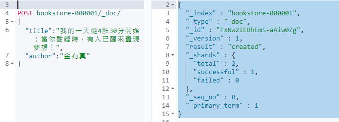

# Elasticsearch Document

&emsp;&emsp;在 Elasticsearch 中以 Document 記錄每一筆資料，如同 MySQL 或 MSSQL 中的 Rows，我們往 RDBM 中 Table 加入一筆資料就是新增一個 Row；在 Elasticsearch 中加入一筆資料的話，則是往 Index 中加入一則 Document  
&emsp;&emsp;Elasticsearch 為文件型資料庫([見NoSQL](https://zh.wikipedia.org/zh-tw/NoSQL))即使用文件儲存資料，這代表我們使用 Elasticsearch 來進行搜尋時搜尋結果的最小單位為 Document，Document 的基本格式為 JSON，在 Elasticsearch 中每個 Document 都一定會有一個獨有的ID

:blue_book: Reference

* [Document APIs](https://www.elastic.co/guide/en/elasticsearch/reference/current/docs.html)
* [Data in: documents and indices](https://www.elastic.co/guide/en/elasticsearch/reference/current/documents-indices.html)

## 簡單上手

在關聯式資料庫中，我們習慣建表後插入數據，來試試如何在 Elasticsearch 中插入一筆資料

* 輸入第一筆資料

    ```JSON
    POST bookstore-000001/_doc/
    {
    "title":"我的一天從4點30分開始：當你酣睡時，有人已醒來實現夢想！",
    "author":"金有真"
    }
    ```

    
    非常的簡單甚至不創建資料表或規定欄位就可以把數據落到磁盤中並持久化 (不過在真實的使用環境下，還是建議將需要搜尋的 Field 用 Mapping 建立相對應的 schema)

    建立成功會回傳
  * _index : 索引
  * _type : 類似於關聯型資料庫的Table，在新版本中這個概念已經被棄用
  * _id: 系統賦予的唯一Id，也可以自訂
  * _version: 版號，資料變動時會更新
  * result : 動作
  * _shards : shards 相關訊息(留給之後的筆記)

    ```JSON
    {
    "_index" : "bookstore-000001",
    "_type" : "_doc",
    "_id" : "TxNw2IEBhEm5-aAiw0Zg",
    "_version" : 1,
    "result" : "created",
    "_shards" : {
        "total" : 2,
        "successful" : 1,
        "failed" : 0
    },
    "_seq_no" : 0,
    "_primary_term" : 1
    }
    ```

## Single document APIs

單文件操作

## Index

藉由指定的 Index 添加 JSON document，如果指定的 document 已經存在，則會更新並把 _version 加一

* `PUT /<target>/_doc/<_id>`  
* `POST /<target>/_doc/`

* 透過 Index 新增

    ```JSON
    POST bookstore-000001/_doc/
    {
    "title":"我的一天從4點30分開始：當你酣睡時，有人已醒來實現夢想！",
    "author":"金有真"
    }
    ```

* 透過 Index 新增，並自訂Id

    ```JSON
    POST bookstore-000001/_doc/1
    {
    "title":"我的一天從4點30分開始：當你酣睡時，有人已醒來實現夢想！",
    "author":"金有真"
    }
    ```

## Get

重索引中取得指定的  JSON document

* 取得文件

    ```JSON
    GET bookstore-000001/_doc/1
    ```

    ```JSON
    {
        "_index" : "bookstore-000001",
        "_type" : "_doc",
        "_id" : "1",
        "_version" : 1,
        "_seq_no" : 1,
        "_primary_term" : 1,
        "found" : true,
        "_source" : {
            "title" : "我的一天從4點30分開始：當你酣睡時，有人已醒來實現夢想！",
            "author" : "金有真"
        }
    }
    ```

* 檢查有無這筆文件資料

    ```JSON
    HEAD bookstore-000001/_doc/1
    ```

    ```JSON
    200 - OK
    ```

    

## Delete

透過指定的 index 與 id 來刪除 document

* 刪除文件

    ```JSON
    DELETE bookstore-000001/_doc/1
    ```

    ```JSON
    {
        "_index" : "bookstore-000001",
        "_type" : "_doc",
        "_id" : "1",
        "_version" : 2,
        "result" : "deleted",
        "_shards" : {
            "total" : 2,
            "successful" : 1,
            "failed" : 0
        },
        "_seq_no" : 2,
        "_primary_term" : 1
    }
    ```

    重新 head 一下，看有甚麼變化

    ```JSON
    HEAD bookstore-000001/_doc/1
    ```

    ```JSON
    {"statusCode":404,"error":"Not Found","message":"404 - Not Found"}
    ```

    已經無此筆資料

## Update

使用指定腳本 `script` 更新文件，在 Elasticsearch 中是沒有真正更新文件這個操作的，文件的更新都是先刪除之後再新建的原子操作(Elasticsearch 的強項是索引跟查詢，要頻繁修改請找專業的 ex MongoDB,MSSQL,MySQL)

* 更新文件

    先插入一筆資料

    ```JSON
    POST bookstore-000001/_doc/1
    {
        "title":"我的一天從4點30分開始：當你酣睡時，有人已醒來實現夢想！",
        "author":"金有真"
    }
    ```

    更新
    用 ctx 指定 _source 下的 title 並賦予預更新的資料

    ```JSON
    POST bookstore-000001/_update/1
    {
        "script" : "ctx._source.title = '我的一天從4點30分開始...'"
    }
    ```

    更新後可以看到 `_version` 從 版本1 變成 版本2 ( _version 為一種樂觀鎖的時候，詳細請見樂觀鎖 vs 悲觀鎖 )

    ```JSON
    {
        "_index" : "bookstore-000001",
        "_type" : "_doc",
        "_id" : "1",
        "_version" : 2,
        "result" : "updated",
        "_shards" : {
            "total" : 2,
            "successful" : 1,
            "failed" : 0
        },
        "_seq_no" : 4,
        "_primary_term" : 1
    }
    ```

## Multi-document APIs

多文件同時操作

## Multi get

* `GET /_mget`
* `GET /<index>/_mget`
* 透過 ID 檢視多個 JSON documents

    ```JSON
    GET /_mget
    {
      "docs": [
        {
          "_index": "bookstore-000001",
          "_id": "1"
        },
        {
          "_index": "bookstore-000001",
          "_id": "2"
        }
      ]
    }
    ```

    ```JSON
    {
      "docs" : [
        {
          "_index" : "bookstore-000001",
          "_type" : "_doc",
          "_id" : "1",
          "_version" : 2,
          "_seq_no" : 4,
          "_primary_term" : 1,
          "found" : true,
          "_source" : {
              "title" : "我的一天從4點30分開始...",
              "author" : "金有真"
          }
        },
        {
          "_index" : "bookstore-000001",
          "_type" : "_doc",
          "_id" : "2",
          "_version" : 1,
          "_seq_no" : 5,
          "_primary_term" : 1,
          "found" : true,
          "_source" : {
              "title" : "這是我的，別想碰！：「所有權」潛規則如何控制我們的生活？",
              "author" : "邁可．海勒, 詹姆斯．薩爾茲曼"
            }
        }
      ]
    }
    ```

    等於

    ```JSON
    GET /bookstore-000001/_mget
    {
    "docs": [
        {
         "_id": "1"
        },
        {
         "_id": "2"
        }
      ]
    }
    ```

    等於

    ```JSON
    GET /bookstore-000001/_mget
    {
    "ids" : ["1", "2"]
    }
    ```

## Bulk

使用起來好用程度排名前幾名的API，可以在一次的 API call 中批次增刪改資料，可以連接減少開銷

* `POST /_bulk`
* `POST /<target>/_bulk`
* Bulk

  ```JSON
  POST _bulk
    { "index" : { "_index" : "test", "_id" : "1" } }
    { "field1" : "value1" }
    { "delete" : { "_index" : "test", "_id" : "2" } }
    { "create" : { "_index" : "test", "_id" : "3" } }
    { "field1" : "value3" }
    { "update" : {"_id" : "1", "_index" : "test"} }
    { "doc" : {"field2" : "value2"} }
  ```

## Delete by query

透過指定的 query 來刪除文件

## Update by query

透過指定的 query 來更新文件
